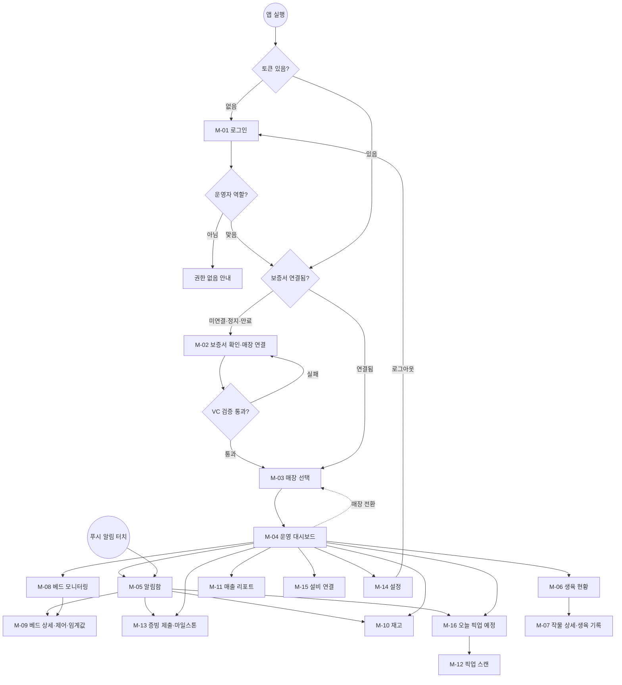

# FarmFi 운영자 앱 기능명세서

> 개발 전달용 · v2.1 · 기준일 2026-08-19
> 대상: Expo React Native 개발자, 백엔드
> 범위: 운영자 모바일 앱(`app/`). 웹(`frontend/`)의 투자·구독·관리자 기능은 `feature-spec.md`가 다룬다.

---

## 0. 앱의 역할

운영자가 배정받은 매장을 현장에서 운영하는 도구다. 재배·설비·재고·매출을 매장 단위로 보고 조치한다.

경계는 **보증서 발급(웹 O-08)**이다. 앱 진입 조건이 보증서 확인(M-02)이고 보증서는 O-08에서 나오므로, 그 전 단계는 앱에서 할 수 없고 그 후는 매장 현장 업무라 앱이 맡는다.

- **웹** — 투자·구독·운영자 심사·정산, 그리고 운영자 신청 흐름 전부(공간 탐색·서류·방문·교육·계약·보증서 발급, O-01~O-08).
- **앱** — 개점 이후 매장 운영 전부.

웹에 남는 예외 셋: 개점 준비 현황(O-09), 매장 운영 현황 조회(O-12, 조작 없음), 생육 레시피·환경 최적화(O-13, 표·차트가 큰 정책 화면).

**앱이 정본인 것**

- **현장 조작** — 설비 제어, 임계값 변경, 재고 조정, 생육·수확 기록. 현장을 보지 않고 설비를 조작하는 경로를 만들지 않기 위한 것이다.
- **증빙 제출과 마일스톤 상태 확인**(M-13) — 영수증과 현장 사진은 촬영으로 만든다. 웹 O-11은 PDF 업로드와 조회만 남는다.
- **운영자 알림**(M-05) — 설비 이상, 증빙 보완 요청, 보증서 만료가 모두 여기로 온다. 웹에 운영자 알림함은 없다.
- **픽업 준비**(M-16) — 웹 B-01~B-09는 구매자 화면이고 운영자용 픽업 목록을 두지 않는다.

**데이터와 판정 기준의 정본은 `feature-spec.md` 9장이다.** DLI·GDD·가동률·2단 밴드·드리프트 판정은 서버가 계산하고 앱은 결과를 그린다. 앱이 자체 기준을 두지 않는다.

웹 흐름이 앱에서 끝나는 지점이 네 곳 있다(0.2).

### 0.1 공통 정책

- 인증은 웹과 같은 JWT를 쓴다. 로그인 응답의 토큰을 SecureStore에 저장하고 `Authorization: Bearer`로 보낸다.
- 모든 조회·조작은 **현재 선택된 매장** 범위로 제한한다. 배정되지 않은 매장의 데이터는 응답에 포함하지 않는다.
- 화면 용어는 `feature-spec.md` 0.4를 따른다. 앱에도 STO·토큰·지갑을 노출하지 않는다.
- 네트워크 실패 시 마지막 조회값과 조회 시각을 함께 표시한다. 빈 화면으로 두지 않는다.
- 제어·저장 API는 idempotency key를 쓴다. 같은 명령을 두 번 보내도 한 번만 실행된다.

### 0.2 웹과 이어지는 지점

| 웹 화면 | 앱에서 하는 일 | 앱 화면 |
|---|---|---|
| O-08 운영자 보증서 발급 | 발급된 Open DID VC를 QR 또는 번호로 확인하고 배정 매장과 연결 | M-02 |
| B-09 픽업 바코드 | 구매자 바코드를 스캔해 수령 완료 처리 | M-12 |
| A-04 공간·설비 구성 | 관리자가 구성한 설비를 현장에서 QR·바코드로 실제 연결 | M-15 |
| O-11 마일스톤 증빙 제출 | 영수증·현장 사진을 촬영해 제출하고 마일스톤 상태를 확인 | M-13 |

이 네 개가 없으면 웹 흐름이 앱에서 끊긴다. 우선순위는 15장 참조.

**이 표가 웹·앱 접점의 정본이다.** 접점이 늘거나 바뀌면 여기를 먼저 고치고 양쪽 화면 정의를 맞춘다. 두 문서에 같은 내용을 따로 적어두면 갈라진다.

---

## 1. 화면 ID와 라우트

Expo Router 기준 경로다.

| ID | 화면 | 라우트 |
|---|---|---|
| M-01 | 로그인 | `/login` |
| M-02 | 보증서 확인·매장 연결 | `/credential` |
| M-03 | 매장 선택·전환 | `/farm/assignment` |
| M-04 | 운영 대시보드 | `/farm/store` |
| M-05 | 알림함 | `/farm/alerts` |
| M-06 | 생육 현황 | `/farm/growth` |
| M-07 | 작물 상세·생육 기록 | `/farm/growth/[cropId]` |
| M-08 | 베드 모니터링 | `/farm/monitoring` |
| M-09 | 베드 상세·센서 이력·임계값 | `/farm/monitoring/[bedId]` |
| M-10 | 재고 | `/farm/inventory` |
| M-11 | 매출 리포트 | `/farm/sales` |
| M-12 | 픽업 스캔 | `/farm/pickup` |
| M-13 | 증빙 제출·마일스톤 확인 | `/farm/evidence` |
| M-14 | 설정 | `/farm/settings` |
| M-15 | 설비 연결 | `/farm/equipment` |
| M-16 | 오늘 픽업 예정 | `/farm/pickup/today` |

### 화면 흐름

M-04 하단 탭: 대시보드 · 생육 · 모니터링 · 재고 · 설정. 픽업 예정(M-16)·증빙 제출(M-13)·설비 연결(M-15)은 대시보드의 "오늘 할 일"과 매장 메뉴에서 들어간다. 픽업 스캔(M-12)은 M-16에서 이어간다. M-15는 필수 설비가 전부 연결되면 메뉴에서 내린다.

보증서가 정지·만료되면 어느 화면에 있든 M-02로 보내고 운영 기능을 막는다.

---

## 2. 인증과 매장 접근

### M-01 · 로그인

- 입력: 이메일, 비밀번호. 웹과 같은 계정을 쓴다.
- 성공: 토큰을 SecureStore에 저장. 보증서 연결 이력이 없으면 M-02, 있으면 M-03으로 간다.
- 실패: 계정 없음, 비밀번호 불일치, 잠금, 네트워크 오류를 구분해 표시한다.
- 앱에 회원가입·비밀번호 재설정을 두지 않는다. 웹으로 안내한다.
- 운영자 역할이 없는 계정은 로그인 후 "운영자 권한이 없습니다" 안내만 표시하고 진입시키지 않는다.

### M-02 · 보증서 확인·매장 연결

웹 O-08에서 발급된 Open DID 보증서(VC)를 앱에서 확인하는 화면이다.

- 확인 방법 두 가지: QR 스캔, 보증서 번호 직접 입력.
- 검증 항목: VC 서명 유효성, 유효기간, 상태(유효·정지·만료), 보증서의 운영자 ID와 로그인 계정 일치.
- 성공: 보증서에 적힌 배정 매장을 계정에 연결하고 M-03으로 간다.
- 실패 사유별 안내: 만료, 정지, 계정 불일치, 서명 검증 실패, 미발급. 각각 다음 행동을 함께 보여준다(웹에서 재발급 요청, 관리자 문의).
- 보증서가 정지·만료되면 다음 실행 시 다시 이 화면으로 보내고 운영 기능을 막는다.
- 표시: 운영자명, 배정 매장, 보증서 번호, 유효기간, 상태.

### M-03 · 매장 선택·전환

- 배정된 매장 목록을 보여준다. 하나면 자동 선택하고 M-04로 간다.
- 매장별로 이름, 주소, 운영 상태, 미확인 알림 수를 표시한다.
- 선택한 매장을 로컬에 저장해 다음 실행 시 바로 M-04로 들어간다.
- M-04 상단에서 언제든 이 화면으로 돌아와 전환할 수 있다.
- 배정 매장이 없으면 빈 상태와 함께 관리자 문의 안내를 표시한다.

---

## 3. 운영 대시보드

### M-04 · 운영 대시보드

선택한 매장의 현황을 한 화면에 모은다. 편집은 각 상세 화면에서 한다.

- 카드 5개: 재배 요약(작물 수·단계별 분포·수확 임박), 알림(미확인 건수·최고 심각도), 오늘 픽업(예정 건수·준비 완료 수), 재고(부족 품목 수), 매출(오늘·이번 주).
- 생육 요약에 DLI 달성률과 수확 D-day를 포함한다.
- 카드별 로딩·실패 상태를 개별로 표시한다. 한 카드가 실패해도 나머지는 보여준다.
- 상단: 매장 이름과 전환 버튼. 하단: 탭 내비게이션.
- 오늘 해야 할 일 한 가지를 맨 위에 고정 표시한다(증빙 보완 요청 > 미확인 심각 알림 > 오늘 픽업 준비 > 부족 재고 > 수확 예정 순).

### M-05 · 알림함

운영자에게 가는 알림을 전부 받는다. 웹에는 운영자 알림함을 두지 않는다.

- 유형과 출처:

  | 유형 | 언제 | 어디서 왔나 |
  |---|---|---|
  | 설비 이상 | 고장 게이트 이탈·드리프트·DLI 미달 | 웹 9.2 판정 |
  | 증빙 보완 요청 | 관리자가 보완·반려 처리 | 웹 A-08 |
  | 증빙 승인 | 단계 승인 완료 | 웹 A-08 |
  | 보증서 | 만료 임박·정지 | 웹 A-03 |
  | 재고 부족 | 부족 기준 이하 | M-10 |
  | 픽업 | 오늘 픽업 예정, 미수령 | M-16 |

- 유형 필터와 미확인만 보기를 제공한다. 기본은 미확인 전체.
- 목록 항목: 발생 시각, 유형, 대상, 심각도, 확인 상태.
- 심각도 2단: 주의(최적대 이탈, 제어 루프가 되돌림), 심각(고장 게이트 이탈, 사람이 조치).
- 확인 처리 시 처리 시각과 처리자를 기록한다. 이미 확인된 알림을 다시 눌러도 상태가 바뀌지 않는다.
- 항목마다 해당 화면으로 바로 이동한다 — 설비→M-09, 증빙→M-13, 보증서→M-14, 재고→M-10, 픽업→M-16.
- 푸시 알림을 탭하면 해당 화면으로 바로 진입한다. 유형별 푸시 수신 여부는 M-14에서 끈다.
- **증빙 보완 요청은 끌 수 없다.** 마일스톤 집행이 걸린 알림이라 수신 설정에서 제외한다.

---

## 4. 재배·생육

### M-06 · 생육 현황

- 작물 목록: 작물명, 배정 베드, 생육 단계, 상태, 수확 예정일.
- 상태 판정 기준은 `feature-spec.md` 9.3을 따른다. 서버가 판정한 결과를 받아 그리고, 앱에서 따로 계산하지 않는다.
- 재배 일정 탭: 파종·수확 예정 목록, 일정 추가.
- 조회 가능한 작물이 없으면 빈 상태를 표시한다.

### M-07 · 작물 상세·생육 기록

- 표시: 생육 단계, GDD 진행률, 수확 예정일과 표준 사이클 대비 지연, DLI 달성률, 기록 이력(최신순).
- 생육 기록 입력: 생육 단계, 관찰 내용, 사진(선택). 필수값이 없으면 저장하지 않고 어느 항목인지 표시한다.
- 저장된 기록은 즉시 이력에 반영한다.
- 재배 일정 등록: 작물, 베드, 파종일, 수확 예정일.
- **수확 기록 입력:** 작물, 베드, 수확량, 단위, 수확 시각. 저장하면 생산량 집계와 기관 리포트(웹 9.1·9.11)에 반영된다. 수확한 품목이 판매 품목과 연결돼 있으면 재고에 입고 처리한다.

---

## 5. 모니터링·제어

### M-08 · 베드 모니터링

- 베드 목록과 각 베드의 현재 상태 요약(정상·주의·심각).
- 베드를 선택하면 M-09로 이동한다.

### M-09 · 베드 상세·센서 이력·임계값

- 현재값: 온도, 습도, CO₂, EC. 최신값을 못 받으면 마지막 수신 시각을 함께 표시한다.
- 차트에 2단 밴드를 그린다 — 최적대(실선)와 고장 게이트(점선). 기준값은 서버의 작물 프로파일에서 받는다.
- 기간별 센서 이력 그래프. X축은 인덱스가 아니라 시간 비례로 그린다. 30일 조회는 다운샘플하되 이상치는 보존한다.
- 드리프트가 탐지된 시점에 세로선을 표시한다.
- 설비 제어: 허용된 설비만 조작 가능. 명령 전송 후 결과를 팝업으로 알린다. 응답이 없으면 실패로 표시하고 실제 설비 상태를 다시 조회한다.
- 같은 제어 명령이 연속으로 눌리면 중복 전송하지 않는다.
- 임계값 설정: 센서 항목별 하한·상한. 저장 시 수정자와 시각을 기록한다.
- 제어 권한이 없는 운영자에게는 조작 버튼을 비활성으로 표시한다.

---

## 6. 재고

### M-10 · 재고

- 목록: 품목명, 현재 수량, 단위, 부족 여부.
- 상세: 입출고 이력, 재고 조정 입력(수량·사유).
- 조정 결과가 음수면 저장하지 않는다.
- 다른 사람이 먼저 조정해 수량이 달라졌으면 최신 수량을 안내하고 다시 입력받는다.
- 품목 등록: 품목명, 단위, 초기 수량, 부족 기준. 같은 매장 안에서 품목명은 중복될 수 없다.
- 조정 후 부족 기준 이하가 되면 부족 알림을 표시하고 대시보드 카드에 반영한다.
- 판매가 기록되면 재고가 자동 차감된다. 앱에서 별도 처리하지 않는다.

---

## 7. 매출

### M-11 · 매출 리포트

- 기간 필터(오늘·주·월·직접 입력)별 매출액, 주문 수, 판매 수량.
- 품목별 판매량과 인기 품목.
- 매출 항목을 선택하면 거래 건별 내역(시각, 품목, 수량, 금액)을 본다.
- 리포트 내보내기: CSV. 한글이 Excel에서 깨지지 않도록 UTF-8 BOM을 붙인다.
- 선택 기간에 데이터가 없으면 빈 상태를 표시한다.

---

## 8. 웹 연동 화면

### M-12 · 픽업 스캔

구매자의 픽업 바코드(웹 B-09)를 읽어 수령 완료로 처리한다.

- 카메라로 바코드를 스캔한다. 스캔이 안 되면 확인번호 직접 입력을 제공한다.
- 스캔 후 표시: 구매자명(마스킹), 픽업 일시, 지점, 팩 구성. 운영자가 상품을 확인한 뒤 수령 완료를 누른다.
- 처리 결과별 안내:
  - 정상 → 수령 완료, 픽업 상태 `COMPLETED`
  - 이미 사용된 바코드 → 사용 완료 시각과 처리자를 표시하고 재처리하지 않는다
  - 다른 지점의 바코드 → 해당 지점명을 표시하고 처리하지 않는다
  - 픽업 예정일이 아님 → 예정 일시를 표시하고 관리자 승인 없이는 처리하지 않는다
- 오프라인일 때는 스캔 결과를 큐에 넣고 복구 시 전송한다. 큐에 남은 건수를 화면에 표시한다.

### M-13 · 증빙 제출·마일스톤 확인

**증빙 제출과 마일스톤 상태 확인의 정본이다.** 웹 O-11은 PDF 업로드와 조회만 하는 보조 경로다.

- 배정 매장의 마일스톤 목록: 단계명, 조건 문구, 집행 예정액, 상태, 필수 증빙 종류와 각각의 제출 여부.
- **촬영으로 만드는 증빙을 전부 여기서 올린다.**

  | 증빙 | 여기서 | 웹에서 |
  |---|---|---|
  | 현장 사진 | ○ | — |
  | 영수증 | ○ (종이 촬영) | — |
  | 계약서·견적서 | — | ○ (PDF) |

- 촬영 또는 갤러리 선택으로 업로드한다. 1건당 20MB 이하, JPG/PNG.
- 영수증은 여러 장을 한 건으로 묶어 올릴 수 있다. 장수와 합계 금액을 함께 입력한다.
- 업로드 시 촬영 시각과 위치를 함께 보낸다. 서버가 파일 해시를 계산한다.
- 필수 증빙이 다 차기 전에는 제출 버튼을 열지 않는다. 웹에서 올린 PDF와 합산해 판단한다.
- 상태 표시: 제출 전, 제출 완료, 검토 중, 승인, 보완 요청. **보완 요청은 사유와 어느 항목이 부족한지를 보여주고 그 자리에서 재촬영·재제출할 수 있다.**
- 승인된 단계는 자동 검증 결과와 관리자 판정 근거(웹 9.8·A-08)를 함께 보여준다.
- 배정되지 않은 매장의 증빙은 제출할 수 없다.

### M-16 · 오늘 픽업 예정

그날 매장에 오는 구독 픽업을 미리 보고 팩을 준비한다. 웹에는 이 화면이 없다.

- 오늘 픽업 예정 목록: 예정 시각, 구매자명(마스킹), 팩 구성(작물·드레싱), 상태.
- **준비 요약**을 맨 위에 둔다 — 팩 크기별 개수(3종 5개, 5종 2개 …)와 작물별 총 필요 수량. 이걸 보고 한 번에 만든다.
- 재고가 부족한 작물은 표시하고 M-10으로 이동한다.
- 상태: 예정 → 준비 완료 → 수령 완료. 준비 완료는 운영자가 직접 체크한다.
- 픽업 항목에서 M-12 스캔으로 바로 넘어간다.
- 픽업 시간이 지났는데 안 온 건은 미수령으로 표시하고 알림을 만든다.
- 날짜를 바꿔 내일·이번 주 예정도 볼 수 있다. 재배 일정(M-06)을 짤 때 쓴다.

### M-15 · 설비 연결

관리자가 웹 A-04에서 구성한 설비 배치를 현장에서 실물과 연결한다.

- 구성된 설비 목록을 존별로 표시한다. 항목: 설비 종류, 코드, 배치 위치, 연결 상태.
- 설비의 QR 또는 바코드를 스캔해 해당 항목에 연결한다. 수동 입력도 제공한다.
- 연결 후 통신 테스트를 실행하고 결과를 표시한다. 센서는 첫 측정값이 들어와야 연결 완료로 본다.
- 처리 결과별 안내: 이미 다른 항목에 연결된 코드, 다른 매장의 설비, 구성에 없는 코드, 통신 실패.
- 상단에 필수 설비 연결 진행률을 표시한다. **필수 설비 100% 연결 + 통신 테스트 통과 + 센서 정상**이 되면 운영 가능 조건 충족으로 표시한다(웹 A-04).
- 연결 해제는 사유 입력 후 가능하다. 해제 이력을 남긴다.

---

## 9. 설정

### M-14 · 설정

- 프로필 조회·수정. 필수값 누락 시 저장하지 않는다.
- 알림 수신 설정: 알림 유형별 on/off, 푸시 수신 여부.
- 보증서 상태 조회. 만료가 가까우면 남은 기간을 표시한다.
- 로그아웃: 확인 후 SecureStore의 토큰과 선택 매장을 지우고 M-01로 간다. 서버 요청이 실패해도 로컬 인증 정보는 지운다.

---

## 10. API

웹과 같은 백엔드를 쓴다. 앱 전용 엔드포인트만 별도로 적는다.

### 인증·매장

- `POST /auth/login` — 응답 body에 토큰 포함(앱은 쿠키를 쓰지 않는다)
- `GET /me`
- `POST /operator/credential/verify` — 보증서 QR·번호 검증, 매장 연결 (앱 전용)
- `GET /operator/stores` — 배정 매장 목록

### 운영

- `GET /stores/{storeId}/summary` — M-04 카드 4종 집계
- `GET /stores/{storeId}/alerts?type=&unreadOnly=` — 설비·증빙·보증서·재고·픽업 통합
- `POST /alerts/{alertId}/acknowledge`
- `GET /stores/{storeId}/crops`
- `GET /crops/{cropId}`
- `POST /crops/{cropId}/growth-records`
- `POST /stores/{storeId}/schedules`
- `POST /stores/{storeId}/harvests`
- `GET /stores/{storeId}/beds`
- `GET /beds/{bedId}/sensors?from=&to=`
- `POST /beds/{bedId}/equipment/{equipmentId}/command`
- `PUT /beds/{bedId}/thresholds`
- `GET /stores/{storeId}/equipment` — 구성된 설비 배치와 연결 상태
- `POST /equipment/{equipmentId}/link` — QR·바코드 연결, 통신 테스트
- `DELETE /equipment/{equipmentId}/link` — 사유 필수
- `GET /stores/{storeId}/inventory`
- `POST /inventory/{itemId}/adjust`
- `POST /stores/{storeId}/inventory`
- `GET /stores/{storeId}/sales?from=&to=`
- `GET /stores/{storeId}/sales/export?format=csv`

### 웹 연동

- `POST /pickups/{pickupId}/complete` — 웹 B-09와 같은 엔드포인트
- `GET /pickups/by-barcode/{barcodeToken}` — 스캔 결과 조회 (앱 전용)
- `GET /stores/{storeId}/pickups?date=` — 예정 목록과 준비 요약 (앱 전용)
- `POST /pickups/{pickupId}/prepared` — 준비 완료 체크
- `GET /operator/milestones?storeId=`
- `POST /operator/milestones/{milestoneId}/evidence`

### 설정

- `PATCH /me`
- `PUT /me/notification-settings`
- `POST /auth/logout`

---

## 11. 상태 정의

### 보증서

`ISSUED → ACTIVE → (SUSPENDED | EXPIRED | REVOKED)`

`ACTIVE`가 아니면 앱 운영 기능을 막고 M-02로 보낸다.

### 픽업

`SCHEDULED → PREPARING → READY → COMPLETED`

예외: `SKIPPED`, `MISSED`, `RESCHEDULED`

앱이 바꿀 수 있는 것은 `READY → COMPLETED` 하나다.

### 설비 제어 명령

`REQUESTED → SENT → (SUCCEEDED | FAILED | TIMEOUT)`

`TIMEOUT`이면 실제 설비 상태를 다시 조회해 표시한다. 자동 재전송하지 않는다.

### 증빙

웹과 같다. `feature-spec.md` 12장의 마일스톤 상태를 따른다.

---

## 12. 데이터 모델

웹과 DB를 공유한다. 앱 때문에 추가되는 것만 적는다.

| 엔터티 | 주요 필드 |
|---|---|
| StoreAssignment | assignmentId, operatorId, storeId, credentialId, status, assignedAt |
| DeviceSession | sessionId, userId, deviceId, platform, pushToken, lastSeenAt |
| PickupScanLog | scanId, pickupId, storeId, scannedBy, result, scannedAt, offlineQueued |
| PickupPrep | pickupId, storeId, preparedBy, preparedAt |
| OperatorNotification | notificationId, userId, storeId, type, targetId, severity, acknowledgedAt, createdAt |
| EquipmentCommand | commandId, equipmentId, command, requestedBy, requestedAt, status, resultAt |

`PickupScanLog`는 실패 스캔도 남긴다. 중복 수령 시도와 오프라인 큐 처리를 추적하기 위한 것이다. `OperatorNotification`의 `type`은 M-05의 유형 목록을 따른다.

---

## 13. 오류 처리

| 코드 | 사용자 안내 | 제공 행동 |
|---|---|---|
| CREDENTIAL_EXPIRED | 보증서 유효기간이 지났어요 | 웹에서 재발급 요청 |
| CREDENTIAL_SUSPENDED | 보증서가 정지된 상태예요 | 관리자 문의 |
| CREDENTIAL_MISMATCH | 이 계정의 보증서가 아니에요 | 다시 스캔, 고객센터 |
| NO_STORE_ASSIGNED | 배정된 매장이 없어요 | 관리자 문의 |
| PICKUP_BARCODE_USED | 이미 수령 처리된 바코드예요 | 픽업 내역 확인 |
| PICKUP_WRONG_BRANCH | 다른 지점의 픽업이에요 | 해당 지점 안내 |
| COMMAND_TIMEOUT | 설비가 응답하지 않아요 | 상태 새로고침, 현장 확인 |
| INVENTORY_CONFLICT | 재고가 방금 변경됐어요 | 최신 수량으로 다시 입력 |
| EVIDENCE_TOO_LARGE | 사진이 20MB를 넘어요 | 다시 촬영 |
| OFFLINE_QUEUED | 지금은 오프라인이라 나중에 전송해요 | 대기 건수 확인 |
| PICKUP_NOT_PREPARED | 아직 준비 완료로 표시하지 않은 픽업이에요 | 준비 목록 보기 |
| EQUIPMENT_ALREADY_LINKED | 이미 다른 자리에 연결된 설비예요 | 연결 현황 보기 |
| EQUIPMENT_NOT_IN_LAYOUT | 이 매장 구성에 없는 설비예요 | 관리자 문의 |
| EQUIPMENT_TEST_FAILED | 연결은 됐는데 통신이 안 돼요 | 다시 시도, 현장 점검 |

---

## 14. 비기능 요구사항

- 최소 터치 영역 44px. 장갑을 낀 상태에서도 누를 수 있어야 한다.
- 색상만으로 상태를 구분하지 않는다. 심각도는 아이콘·텍스트를 함께 쓴다.
- 매장 현장은 조명이 밝다. 대비를 충분히 준다.
- 바코드 스캔 화면은 카메라 권한 거부 시 번호 직접 입력으로 대체한다.
- 대시보드 첫 응답 2초 이내 목표. 캐시된 값을 먼저 그리고 갱신한다.
- 센서 30일 조회는 다운샘플해서 보낸다. 클라이언트에서 2,880점을 그대로 그리지 않는다.
- 토큰은 SecureStore에만 둔다. AsyncStorage나 파일에 쓰지 않는다.

---

## 15. 개발 우선순위

### P0

1. 로그인·토큰 저장(M-01)
2. 보증서 확인·매장 연결(M-02) — 웹 O-08이 앱에서 끝나는 지점
3. 매장 선택(M-03)·대시보드(M-04)
4. **설비 연결(M-15)** — 웹 A-04가 앱에서 끝나는 지점. 이게 없으면 매장이 운영 가능 상태가 되지 않는다
5. 베드 모니터링·제어(M-08·M-09)
6. 픽업 스캔(M-12) — 웹 B-09가 앱에서 끝나는 지점

### P1

1. 생육 현황·기록(M-06·M-07)
2. 재고(M-10)
3. 증빙 제출·마일스톤 확인(M-13)
4. 알림함(M-05) — 증빙 보완 요청이 운영자에게 닿는 유일한 경로
5. 오늘 픽업 예정(M-16) — 팩 준비. 이게 없으면 운영자가 손님이 와야 안다
6. 설정(M-14)

### P2

1. 매출 리포트·내보내기(M-11)
2. 오프라인 스캔 큐
3. 푸시 알림

---

## 16. MVP 완료 기준

- 운영자가 웹에서 발급받은 보증서를 앱에서 확인하고 배정 매장에 연결할 수 있다.
- 매장을 선택하면 재배·설비·재고·매출 요약이 한 화면에 뜬다.
- 베드 센서값을 보고 설비를 조작할 수 있고, 실패하면 실패로 표시된다.
- 관리자가 구성한 설비를 현장에서 QR로 연결하고, 필수 설비 100% 연결·통신 테스트 통과까지 진행률로 확인할 수 있다.
- 운영자가 그날 픽업 예정과 팩 크기별 필요 수량을 미리 보고 준비할 수 있다.
- 관리자가 증빙 보완을 요청하면 운영자 앱으로 알림이 가고, 그 자리에서 재촬영·재제출할 수 있다.
- 영수증과 현장 사진을 앱에서 촬영해 올릴 수 있고, 계약서 PDF만 웹에서 올린다.
- 구매자 픽업 바코드를 스캔해 수령 완료 처리할 수 있고, 같은 바코드는 두 번 처리되지 않는다.
- 배정되지 않은 매장의 데이터는 어떤 화면에서도 보이지 않는다.
- 보증서가 정지·만료되면 운영 기능이 막힌다.
- 화면 어디에도 STO·토큰·지갑이 노출되지 않는다.
