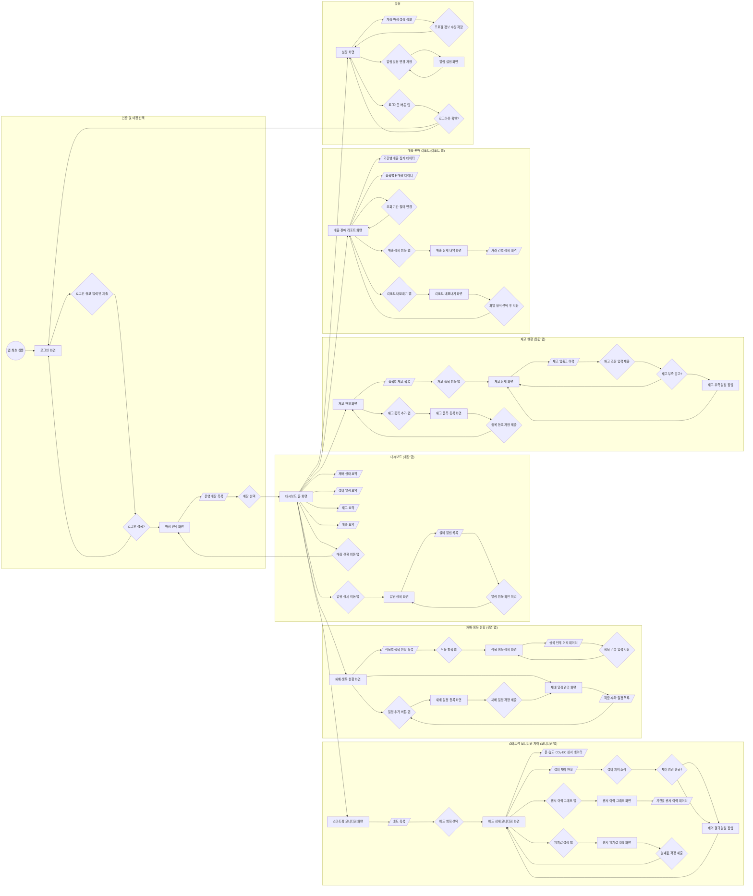

# 팜피 운영자 앱 유저플로우

운영자 모바일 앱(`app/`)의 화면 이동 경로다. 웹(`frontend/`)의 투자자·건물주 플로우는 `user-flow.md`가 다룬다.

```mermaid
flowchart LR

  subgraph s1 ["인증 및 매장 선택"]
    n1(("앱 최초 실행"))
    n2["로그인 화면"]
    n3{"로그인 정보 입력 및 제출"}
    n4{"로그인 성공?"}
    n5["매장 선택 화면"]
    n6[/"운영 매장 목록"/]
    n7{"매장 선택"}
  end

  subgraph s2 ["대시보드 (매장 탭)"]
    n8["대시보드 홈 화면"]
    n9[/"재배 상태 요약"/]
    n10[/"설비 알림 요약"/]
    n11[/"재고 요약"/]
    n12[/"매출 요약"/]
    n13{"매장 전환 버튼 탭"}
    n14{"알림 상세 이동 탭"}
    n15["알림 상세 화면"]
    n16[/"설비 알림 목록"/]
    n17{"알림 항목 확인 처리"}
  end

  subgraph s3 ["재배·생육 현황 (운영 탭)"]
    n18["재배·생육 현황 화면"]
    n19[/"작물별 생육 현황 목록"/]
    n20{"작물 항목 탭"}
    n21["작물 생육 상세 화면"]
    n22[/"생육 단계·이력 데이터"/]
    n23{"생육 기록 입력 저장"}
    n24["재배 일정 관리 화면"]
    n25[/"파종·수확 일정 목록"/]
    n26{"일정 추가 버튼 탭"}
    n27["재배 일정 등록 화면"]
    n28{"재배 일정 저장 제출"}
  end

  subgraph s4 ["스마트팜 모니터링·제어 (모니터링 탭)"]
    n29["스마트팜 모니터링 화면"]
    n30[/"베드 목록"/]
    n31{"베드 항목 선택"}
    n32["베드 상세 모니터링 화면"]
    n33[/"온·습도·CO₂·EC 센서 데이터"/]
    n34[/"설비 제어 현황"/]
    n35{"설비 제어 조작"}
    n36{"제어 명령 성공?"}
    n37["제어 결과 알림 팝업"]
    n38{"센서 이력 그래프 탭"}
    n39["센서 이력 그래프 화면"]
    n40[/"기간별 센서 이력 데이터"/]
    n41{"임계값 설정 탭"}
    n42["센서 임계값 설정 화면"]
    n43{"임계값 저장 제출"}
  end

  subgraph s5 ["재고 현황 (통합 탭)"]
    n44["재고 현황 화면"]
    n45[/"품목별 재고 목록"/]
    n46{"재고 품목 항목 탭"}
    n47["재고 상세 화면"]
    n48[/"재고 입출고 이력"/]
    n49{"재고 조정 입력 제출"}
    n50{"재고 품목 추가 탭"}
    n51["재고 품목 등록 화면"]
    n52{"품목 등록 저장 제출"}
    n53{"재고 부족 경고?"}
    n54["재고 부족 알림 팝업"]
  end

  subgraph s6 ["매출·판매 리포트 (리포트 탭)"]
    n55["매출·판매 리포트 화면"]
    n56[/"기간별 매출 집계 데이터"/]
    n57[/"품목별 판매량 데이터"/]
    n58{"조회 기간 필터 변경"}
    n59{"매출 상세 항목 탭"}
    n60["매출 상세 내역 화면"]
    n61[/"거래 건별 상세 내역"/]
    n62{"리포트 내보내기 탭"}
    n63["리포트 내보내기 화면"]
    n64{"파일 형식 선택 후 저장"}
  end

  subgraph s7 ["설정"]
    n65["설정 화면"]
    n66[/"계정·매장 설정 정보"/]
    n67{"프로필 정보 수정 저장"}
    n68{"알림 설정 변경 저장"}
    n69["알림 설정 화면"]
    n70{"로그아웃 버튼 탭"}
    n71{"로그아웃 확인?"}
  end

  n1 --> n2
  n2 --> n3
  n3 --> n4
  n4 --> n5
  n4 --> n2
  n5 --> n6
  n6 --> n7
  n7 --> n8
  n8 --> n9
  n8 --> n10
  n8 --> n11
  n8 --> n12
  n8 --> n13
  n13 --> n5
  n8 --> n14
  n14 --> n15
  n15 --> n16
  n16 --> n17
  n17 --> n15
  n8 --> n18
  n18 --> n19
  n19 --> n20
  n20 --> n21
  n21 --> n22
  n22 --> n23
  n23 --> n21
  n18 --> n26
  n18 --> n24
  n24 --> n25
  n25 --> n26
  n26 --> n27
  n27 --> n28
  n28 --> n24
  n8 --> n29
  n29 --> n30
  n30 --> n31
  n31 --> n32
  n32 --> n33
  n32 --> n34
  n34 --> n35
  n35 --> n36
  n36 --> n37
  n36 --> n37
  n37 --> n32
  n32 --> n38
  n38 --> n39
  n39 --> n40
  n32 --> n41
  n41 --> n42
  n42 --> n43
  n43 --> n32
  n8 --> n44
  n44 --> n45
  n45 --> n46
  n46 --> n47
  n47 --> n48
  n48 --> n49
  n49 --> n53
  n53 --> n54
  n53 --> n47
  n54 --> n47
  n44 --> n50
  n50 --> n51
  n51 --> n52
  n52 --> n44
  n8 --> n55
  n55 --> n56
  n55 --> n57
  n55 --> n58
  n58 --> n55
  n55 --> n59
  n59 --> n60
  n60 --> n61
  n55 --> n62
  n62 --> n63
  n63 --> n64
  n64 --> n55
  n8 --> n65
  n65 --> n66
  n66 --> n67
  n67 --> n65
  n65 --> n68
  n68 --> n69
  n69 --> n68
  n65 --> n70
  n70 --> n71
  n71 --> n2
  n71 --> n65
```
