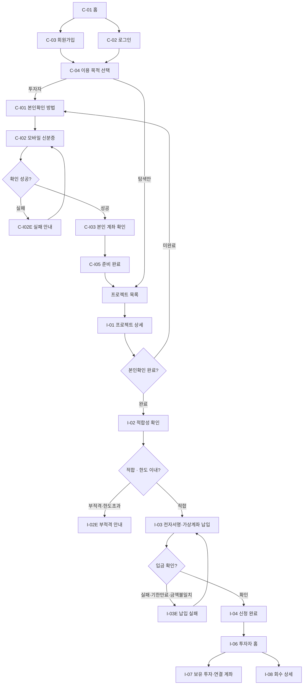
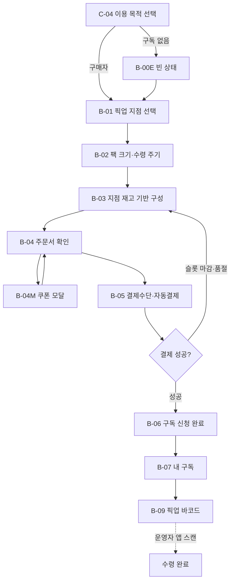
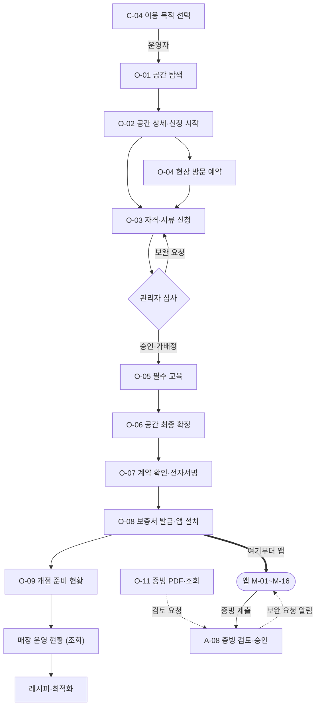
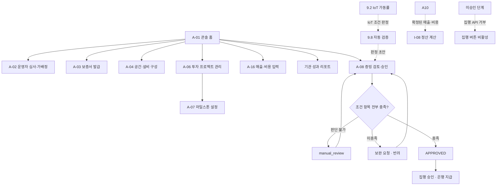

# FarmFi 웹사이트 기능명세서

> 개발 전달용 · v2.1 · 기준일 2026-08-19
> 기준 디자인: Figma `FarmFi 화면 정의 · MVP 우선순위` 페이지
> 대상: 웹 프론트엔드, 백엔드, 블록체인, Open DID 연동 개발자

---

## 0. 핵심 결정

### 0.1 서비스 정의

FarmFi는 공실을 도심 스마트팜 매장으로 전환하고, 투자자·구매자·운영자·관리자가 투자, 구독, 개점 준비, 운영 및 정산 과정을 함께 관리하는 서비스다.

### 0.2 STO 및 토큰 정책

- **사용자 화면에는 STO·토큰이라는 용어와 개념을 노출하지 않는다.** (0.4 용어 정책)
- **투자자에게 투자자용 자산 지갑을 노출하지 않는다.** 주소·개인키·가스비를 화면에 보여주지 않으며, 투자자에게 지갑 설치·주소 입력을 요구하지 않는다.
- 보유 원장은 체인에 둔다. 팜피가 투자자별 **수탁 지갑**을 서버에서 생성·관리하고, 투자 확정 시 그 지갑 앞으로 보유 구좌를 발행한다.
- 1구좌 = 1만 원. 100만 원 투자 시 100구좌를 발행한다. 컨트랙트는 소수점을 두지 않아 내부 값도 정수다.
- 투자금과 회수금은 모두 **원화 계좌**를 통해 이동한다. 블록체인은 현금을 보관하거나 송금하지 않는다.
- 투자자는 특정 프로젝트에 현금으로 참여하고, 계약·집행·정산 이력을 확인한다.
- 증권성 여부는 토큰 유무와 별개이므로, 실제 투자 모집 전 별도의 법률 검토가 필요하다.

### 0.3 블록체인·스마트컨트랙트·지갑 사용 방식

| 기술 | MVP에서의 역할 |
|---|---|
| OmniOne Chain (BESU) | 투자계약, 단계별 집행, 정산 계산 결과, 원화 이체 결과의 변경 방지 기록 + 투자자별 보유 원장(구좌) |
| 스마트컨트랙트 | 계약 조건 저장, 단계 상태 전환, 참여자별 정산액 계산, 승인 이력 관리 + 보유 구좌 발행·이전·조회 |
| Open DID | 투자자·운영자의 신원 또는 자격증명 발급·제출·검증 |
| Open DID Wallet/SDK | DID·VC 생성·보관·제출, 모바일 신분증 확인, 운영자 보증서 제공 (신원·자격 전용, 자산 지갑 아님) |
| 은행·PG·지급 API | 투자금 출금, 결제, 운영자 보수·공간사용료·투자 회수금의 실제 원화 이체 |

> **구현 결정:** Open DID 공개 SDK·서버를 팀 인프라에 직접 설치한다. 투자자에게 BESU 주소 생성·복사·입력을 요구하지 않는다. **투자자별 수탁 지갑은 팜피 백엔드가 생성·관리하며, 키는 KMS/HSM에 둔다.** FarmFi 백엔드의 Chain Relay가 승인된 운영키로 BESU 트랜잭션(기록 + 구좌 발행)을 제출한다. 현금은 은행·PG에서 이동한다.

> **용어 주의:** Open DID의 `Wallet SDK`(신원·VC 보관용)와 투자자 **수탁 지갑**(자산 원장용)은 완전히 다른 것이다. 같은 "지갑"이라도 층이 다르다. 화면·문서·변수명에서 섞지 않는다.

### 0.4 사용자에게 보여주는 용어

| 사용 금지 | 사용자 화면에서 사용할 표현 |
|---|---|
| STO, 토큰증권 | 프로젝트 투자 |
| 토큰 배정, 보유 토큰 | 투자 금액, 프로젝트 참여 내역, 보유 구좌 (예외는 18장) |
| 배당 | 회수금, 받은 수익, 지급 예정액 |
| 지갑 설치, 지갑주소 입력 | 모바일 신분증 확인, 본인 계좌 확인 |
| 체인 주소로 회수금 지급 | 등록 계좌로 회수금 지급 |
| 스마트컨트랙트 실행 | 계약 조건에 따라 계산·기록 |
| 임대료 우선, 배당 60%, 적자 구간 우선 배분 | 최신 단위경제 모델의 비용·회수 조건 API 값을 표시 |

토큰을 발행하더라도 화면 언어는 위 표를 따른다. 발행은 백엔드·체인 내부 동작이며 화면에 드러내지 않는다.

**금액·보유 표시 규칙**

- `보유 구좌`를 표시하는 화면에는 투자 원금이 보전되지 않는다는 문구를 같은 화면에 둔다.
- `회수금`·`지급 예정액`은 운영 결과에 따른 분배액이다. 확정 금액이 아니라는 문구와 함께 표시하고, 숫자만 단독으로 크게 보여주지 않는다.
- `예정`·`예상`이 붙은 금액은 확정 금액과 시각적으로 구분한다.
- 원금 비보장·중도 회수 제한·손실 가능성 문구는 위 대체 표현의 적용 대상이 아니다. 그대로 쓴다.

---

## 1. 개발 범위

### 1.1 MVP 필수 범위

- 공통: 홈, 로그인, 회원가입, 역할 선택
- 투자자: 본인확인, 본인 계좌 확인, 프로젝트 조회, 적합성 확인, 전자 동의, 가상계좌 납입, 투자 내역, 회수 내역
- 구매자: 픽업 지점 선택, 팩 구성, 쿠폰, 결제, 정기구독, 픽업 바코드
- 운영자: 공간 탐색, 신청, 현장 방문, 교육, 계약, 보증서, 개점 준비, **마일스톤 증빙 제출(O-11)**, **매장 운영 현황**
- 관리자: 운영자 심사, 보증서 발급, 공간·설비 구성, 투자 프로젝트와 마일스톤 관리, **마일스톤 증빙 검토·승인(A-08)**, **매출·비용 입력(A-16)**
- 운영 데이터: IoT 수집·이상 판정, 생육 모니터링, 마일스톤 자동 검증(9장)
- 공통 예외: 인증 실패, 투자 부적격·한도 초과, 납입 실패, 구독 없음, 쿠폰 모달

> 증빙 검증이 없으면 관리자가 증빙 없이 승인하게 되고, 그러면 "조건 충족 시에만 집행"이라는 자금통제 근거가 사라진다. O-11·A-08이 MVP 필수인 이유다.

### 1.2 후속 개발 범위

- 투자 신청·취소 전체 이력
- 구독 구성·일정 변경
- 마일스톤 증빙 보완·이의제기(O-11E), 관리자 재검토·외부 전문가 판정(A-09)
- 정산 규칙 편집
- 권한 관리·알림 발송·AML 및 이상거래
- 생육 레시피·환경 최적화 화면과 기관 성과 리포트
- 기관 계정 관리 — MVP에서는 관리자가 발행한 링크로만 조회한다

### 1.3 웹과 앱의 분담

투자자·구매자·관리자·기관은 웹 전용이다. 운영자만 두 표면에 걸치고, 그 경계는 **보증서 발급(O-08)**이다.

앱 진입 조건이 보증서 확인(M-02)이고 보증서는 O-08에서 나온다. 그 전 단계는 앱에서 할 수가 없고, 그 후 단계는 매장 현장 업무라 폰이 맞다.

| 단계 | 담당 | 화면 |
|---|---|---|
| O-08 **이전** — 공간 탐색·서류·방문·교육·계약·보증서 발급 | 웹 | O-01~O-08 |
| O-08 **이후** — 개점 후 매장 운영 | 앱 | M-01~M-16 |

**웹에 남는 예외 셋**

| 화면 | 웹에 두는 이유 |
|---|---|
| O-09 개점 준비 현황 | 개점 전 한 번 보는 진행률. 앱에 옮길 값이 작다 |
| 매장 운영 현황 | 같은 데이터를 매장 밖 큰 화면에서 조회. **조작 기능 없음** |
| 생육 레시피·환경 최적화 | 표·차트가 크고, 현장 조작이 아니라 정책을 바꾸는 화면 |

**규칙**

- **현장 조작은 앱에서만 한다.** 설비 제어·임계값·재고 조정·생육/수확 기록. 현장을 보지 않고 설비를 조작하는 경로를 만들지 않기 위한 것이다.
- **증빙 제출과 마일스톤 상태 확인의 정본은 앱(M-13)이다.** 웹 O-11은 PDF 문서 업로드와 조회만 남긴다. 영수증·현장 사진은 종이와 실물이라 폰에서 만든다.
- **운영자 알림의 정본은 앱(M-05)이다.** 증빙 보완 요청, 설비 이상, 보증서 만료가 모두 여기로 간다. 웹에 운영자 알림함을 따로 두지 않는다.
- **운영자의 픽업 준비는 앱(M-16)에서 한다.** 웹 B-01~B-09는 구매자 화면이고 운영자용 픽업 목록을 두지 않는다.
- 운영 데이터와 판정 기준의 정본은 이 문서 9장이다. 앱은 서버가 판정한 결과를 그리고 자체 기준을 두지 않는다.
- 웹 흐름이 앱에서 끝나는 접점이 네 개 있다 — 보증서 확인(O-08→M-02), 설비 연결(A-04→M-15), 픽업 스캔(B-09→M-12), 증빙 제출(O-11→M-13). **접점 정의의 정본은 `app-feature-spec.md` 0.2 표다.**

앱 화면 정의는 `app-feature-spec.md`에 있다.

### 1.4 화면 ID와 라우트

Next.js App Router 기준 경로다. 화면 ID는 `design/farmfi-web.fig`를 따른다. P0 화면 정의는 4~8장에 있고, 티어·Figma 덤프 경로·역할 내비는 `figma-route-map.md`에 있다.

| ID | 화면 | 라우트 |
|---|---|---|
| C-01 | 서비스 홈 | `/` |
| C-02 | 로그인 | `/login` |
| C-03 | 회원가입 | `/signup` |
| C-04 | 이용 목적 선택 | `/start` |
| C-I01 | 본인확인 방법 선택 | `/verify` |
| C-I02 · C-I02E | 모바일 신분증 확인 · 실패 | `/verify/mobile-id` |
| C-I03 | 본인 명의 계좌 확인 | `/verify/account` |
| C-I05 | 본인확인 완료 | `/verify/done` |
| I-01 | 프로젝트 상세 | `/projects/[id]` |
| I-02 · I-02E | 투자 적합성 확인 · 부적격 | `/projects/[id]/invest/eligibility` |
| I-03 · I-03E | 최종 확인·전자서명·납입 · 실패 | `/projects/[id]/invest/confirm` |
| I-04 | 투자 신청 완료 | `/projects/[id]/invest/done` |
| I-05 | 투자 신청·취소 내역 | `/investor/applications` |
| I-06 | 투자자 홈 | `/investor` |
| I-07 | 보유 투자·연결 계좌 | `/investor/holdings` |
| I-08 | 투자금 회수 상세 | `/investor/payouts/[id]` |
| I-09 | 투자자 알림함 | `/investor/notifications` |
| I-10 | 투자자 알림 설정 | `/investor/notifications/settings` |
| B-01 | 픽업 지점 선택 | `/subscribe` |
| B-02 | 팩 크기·수령 주기 | `/subscribe/plan` |
| B-03 | 지점 재고 기반 구성 | `/subscribe/compose` |
| B-04 · B-04M | 주문서 확인 · 쿠폰 모달 | `/subscribe/order` |
| B-05 | 결제수단·자동결제 | `/subscribe/payment` |
| B-06 | 구독 신청 완료 | `/subscribe/done` |
| B-07 · B-00E | 내 구독 · 구독 없음 | `/subscriptions` |
| B-08 | 구성·일정 변경 | `/subscriptions/change` |
| B-09 | 픽업 바코드 | `/subscriptions/pickup/[id]` |
| O-01 | 운영 공간 탐색 | `/operator/spaces` |
| O-02 | 공간 상세·신청 시작 | `/operator/spaces/[id]` |
| O-03 | 자격·서류 신청 | `/operator/apply` |
| O-04 | 현장 방문 예약 | `/operator/apply/visit` |
| O-05 | 필수 교육 | `/operator/apply/education` |
| O-06 | 공간 최종 확정 | `/operator/apply/confirm` |
| O-07 | 계약 확인·전자서명 | `/operator/apply/contract` |
| O-08 | 운영자 보증서 발급·앱 설치 | `/operator/certificate` |
| O-09 | 개점 준비 현황 | `/operator` |
| O-10 | 마일스톤 검증 현황 | `/operator/milestones` |
| O-11 | 마일스톤 증빙 제출 | `/operator/milestones/[id]/evidence` |
| O-11E | 증빙 보완·이의제기 | `/operator/milestones/[id]/appeal` |
| O-12 | 마일스톤 집행 완료 | `/operator/milestones/[id]/done` |
| O-13 | 정산·지급 내역 | `/operator/settlements` |
| A-01 | 콘솔 홈 | `/admin` |
| A-02 | 운영자 심사·가배정 | `/admin/operators` |
| A-03 | 보증서 발급 관리 | `/admin/certificates` |
| A-04 | 공간·설비 구성 | `/admin/spaces` |
| A-05 | 구독·픽업 예외 관리 | `/admin/subscriptions` |
| A-06 | 투자 프로젝트 관리 | `/admin/projects` |
| A-07 | 마일스톤 설정 | `/admin/projects/[id]/milestones` |
| A-08 | 마일스톤 증빙 재검토 | `/admin/evidence` |
| A-09 | 외부 전문가 최종 판정 | `/admin/expert-review` |
| A-10 | 정산 규칙 | `/admin/settlement-rules` |
| A-11 | 정산 결과 | `/admin/settlements` |
| A-12 | 감사 로그 | `/admin/audit-logs` |
| A-13 | 권한 관리 | `/admin/roles` |
| A-14 | 알림 발송 | `/admin/notifications` |
| A-15 | AML·이상거래 | `/admin/aml` |
| A-16 | 매출·비용 입력 | `/admin/ledger` |

`A-05`는 `.fig`에 도면이 없고 관리자 콘솔 사이드바에도 없다. 라우트·API는 살아 있고 직접 URL로만 연다.

#### Figma에 없는 화면

`.fig` 화면 목록 밖이지만 웹에 있는 경로다. 화면 ID를 붙이지 않는다.

| 화면 | 라우트 |
|---|---|
| 프로젝트 목록 | `/projects` |
| AI 검증 현황 | `/monitoring/[projectId]` |
| 생육 레시피·환경 최적화 | `/optimization/[projectId]` |
| 기관 성과 리포트 | `/admin/reports` |
| 마일스톤 판정 패널 | `/admin/verify` |
| 보유 구좌 발행 | `/admin/issuances` |
| 데모 제어 | `/admin/demo` |
| 유휴공간 등록 · 내 공간 | `/space` · `/landlord` |
| 통합 마이페이지 | `/mypage` |
| 서비스 소개 | `/about` |

`지갑 주소 등록`·`지갑 재연결` 경로는 만들지 않는다. 기존 URL로 들어오면 `/verify/account` 또는 `/verify/done`으로 리다이렉트한다.

### 1.5 화면 흐름

각 화면의 내용은 4~8장에 있다. 여기는 이동과 분기만 그린다.

**공통 진입 · 투자자**



`I-03 → I-04` 사이에 `CHAIN_PENDING`이 있다. 화면은 `입금 확인 완료 · 기록 처리 중`으로 표시하고 자동으로 넘어간다.

**구매자**



**운영자**



**관리자 · 집행 게이트**



`APPROVED`가 아니면 집행 API가 거부한다(A-08). 이 게이트가 조건부 집행의 전부다.

---

## 2. 사용자 역할과 권한

| 역할 | 주요 권한 | 접근 제한 |
|---|---|---|
| 비회원 | 서비스 홈, 구독 플랜 조회 | 진행 중 프로젝트 목록·상세는 로그인 후. 투자 신청·구독 결제·운영 신청 불가 |
| 투자자 | 본인확인, 프로젝트 투자, 계약 서명, 투자·회수 내역 조회 | 최초 투자 전 모바일 신분증 확인 필수 |
| 구매자 | 지점·팩 구성, 자동결제, 구독·픽업 관리 | 결제수단 등록 및 필수 약관 동의 필요 |
| 운영자 | 공간 신청, 서류 제출, 교육, 계약 서명, 보증서 확인, 마일스톤 증빙 제출, 배정 지점 운영 현황 조회 | 자격·교육·계약 단계에 따라 기능 순차 해제. 배정 지점 외 데이터 접근 불가 |
| 관리자 | 심사, 배정, 프로젝트·마일스톤·설비·정산 관리, 증빙 검토·승인, 매출·비용 확정 | 관리자 권한 필요, 모든 변경은 감사 로그 기록 |
| 외부 전문가 | 배정된 증빙 건의 최종 판정 | 관리자 지정 건만 조회·판정 가능 |
| 기관 | 연결된 지점의 성과 리포트 조회 | 조회 전용. 발행된 리포트만 접근 |

한 계정은 복수 역할을 가질 수 있다. 로그인 후 역할 선택 화면에서 진입하며, 상단 내비게이션에는 현재 역할에 해당하는 메뉴만 표시한다.

역할에 없는 화면은 주소창으로 들어와도 열리지 않는다. 오류 문구 대신 자기 역할의 홈으로 보낸다 — 잘못 눌러 들어온 사용자에게 필요한 것은 돌아갈 곳이다. 로그인하지 않았으면 로그인 화면으로 보내고, 확인을 마치면 원래 가려던 곳으로 돌아온다. 매장 단위 화면은 역할에 더해 배정까지 본다.

---

## 3. 공통 시스템 정책

### 3.1 인증 및 세션

- 이메일·비밀번호 로그인을 기본 제공한다.
- 비밀번호는 영문·숫자·특수문자를 포함한 10자 이상으로 검증한다.
- 로그인 유지 여부를 선택할 수 있다.
- 역할별 인증 상태를 세션과 분리해 저장한다.
- 일반 로그인 완료가 투자 자격 확인 완료를 의미하지 않는다.

### 3.2 본인확인

- 첫 투자 전 모바일 신분증 확인이 필수다.
- 간편인증만 완료한 사용자는 프로젝트 탐색은 가능하나 투자 신청 직전에 다시 본인확인을 요청한다.
- 저장 항목: 본인확인 성공 여부, 실명 일치 여부, 성인 여부, 확인 시각, 제공기관 응답 ID.
- 신분증 원문 이미지와 전체 개인정보는 FarmFi 서버에 저장하지 않는다.

### 3.3 Open DID 및 체인 계정

- Open DID는 신원·자격증명 발급·제출·검증에만 사용한다. (자산 지갑 아님)
- 투자자 화면에 체인 주소, 개인키, 가스비, 토큰 잔액을 노출하지 않는다.
- **투자자용 자산 지갑은 팜피 백엔드가 수탁 방식으로 생성·관리한다.** 투자자 1인당 하나의 BESU 수탁 지갑을 서버가 만들고, 투자 확정 시 그 지갑 앞으로 보유 구좌를 발행한다.
- 수탁 지갑의 키와 운영키는 로컬 파일·DB·환경변수 평문으로 저장하지 않는다. 개발은 암호화 키스토어, 운영은 KMS/HSM을 사용한다.
- 계약 동의는 본인확인 세션, 동의 문서 버전, 동의 시각, 전자서명값을 서버에 저장하고 문서 해시를 체인에 기록한다.
- BESU 트랜잭션(기록·발행·이전)은 허용된 백엔드 서비스 계정만 제출한다. 프론트엔드는 체인을 직접 호출하지 못한다.

### 3.4 원화 결제·이체

- 투자금: 본인 명의 연결 계좌 또는 건별 가상계좌로 납입한다.
- 구독료: 카드·간편결제 자동결제를 사용한다.
- 운영자 보수·공간사용료·투자 회수금: 지급 API 또는 관리자 승인 후 등록 계좌로 계좌이체한다.
- 체인에는 계좌번호 전체를 기록하지 않는다. 거래 식별값, 금액, 상태, 시각, 원장 해시만 기록한다.
- **투자금 분리보관:** 실제 투자 모집 단계에서 투자금은 팜피 고유계정과 분리해 **신탁**으로 보관한다. 이는 인가·계약 사항이며 출시 전 게이트(17.3)에서 확정한다. MVP/데모 단계에서는 분리보관 어댑터(`FundCustodyAdapter`)를 Mock으로 두고, 화면·데이터 모델에 "분리보관 · 출시 시 신탁 적용" 상태를 표시한다.

> **용어 확정:** 자금 보관은 **신탁**으로 표기한다. "에스크로"는 전자상거래 결제대금예치를 뜻하는 다른 개념이므로 이 맥락에서 사용하지 않는다. 투자자 보호(도산 격리)는 신탁의 역할이고, 조건부 집행은 마일스톤 게이트의 역할이다. 화면·변수명·주석·로그 어디에도 에스크로라는 단어를 쓰지 않는다.

### 3.5 상태값 공통 규칙

- 서버 상태가 단일 진실 공급원이다. 체인 기록은 비동기로 뒤따른다.
- 버튼 연타 방지를 위해 결제·서명·상태 변경 API는 idempotency key를 사용한다.
- 긴 작업은 `요청 → 처리 중 → 완료/실패` 상태로 표시한다.
- 실패 시 원인, 다음 행동, 재시도 버튼을 함께 제공한다.
- 관리자 변경은 처리자, 사유, 이전 값, 변경 값, 시각을 감사 로그에 기록한다.

---

## 4. 공통 진입 기능

### C-01 · 서비스 홈

**목적**
로그인 전 사용자가 FarmFi의 투자·구독·운영 서비스를 이해하고 원하는 역할로 진입한다.

**주요 기능**

- 공통 내비게이션: 서비스 소개, 프로젝트, 정기구독, 로그인
- 로그인 전에는 `내 투자`, `알림`, `운영자 메뉴`, `관리자 메뉴`를 노출하지 않는다.
- 투자 프로젝트 카드 조회 및 필터링. **로그인 전에는 목록을 잠근다** — 카드는 보이되 위를
  덮어 개별 프로젝트로 들어가지 못하게 하고, 그 자리에 로그인·회원가입을 놓는다. 지우지 않고
  덮는 이유는 무엇이 잠겨 있는지 보여야 로그인할 이유가 생기기 때문이다.
- 정기구독 서비스 진입
- 운영자 신청 안내 진입
- 역할별 CTA 제공

**개발 규칙**

- 예상 회수율은 프로젝트 API 값이 있을 때만 표시하고, 9.10의 신뢰도 등급을 함께 받는다. `projected`는 여기에 게재하지 않는다.
- 모든 프로젝트에 동일한 비율을 하드코딩하지 않는다.
- 공간 규모, 설비 구성, 예상 판매량, 비용 구조를 반영한 프로젝트별 값을 사용한다.
- `원금 비보장`, `운영 결과에 따라 달라짐`을 카드 또는 상세 진입 전에 표시한다.

### C-02 · 로그인

- 입력: 이메일, 비밀번호
- 선택: 로그인 상태 유지
- 기능: 로그인, 비밀번호 찾기, 회원가입 이동
- 성공: C-04 역할 선택 또는 마지막 사용 역할의 홈
- 실패: 계정 없음, 비밀번호 불일치, 잠금, 네트워크 오류를 구분

### C-03 · 회원가입

- 입력: 이메일, 비밀번호, 비밀번호 확인
- 동의: 이용약관·개인정보 필수, 마케팅 선택
- 이메일 중복 확인
- 가입 완료 후 C-04로 이동
- 가입 단계에서는 투자자·구매자·운영자를 미리 고정하지 않는다.

### C-04 · 이용 목적 선택

- 선택지: 투자자로 이용, 구매자로 이용, 운영자로 이용
- 한 계정이 여러 역할을 선택할 수 있다.
- 운영자 선택 시 운영 자격 확인 절차로 이동한다.
- 마지막 선택 역할을 저장하되 상단 역할 전환에서 변경 가능하다.

---

## 5. 투자자 기능

### 5.1 투자자 준비 흐름

`본인확인 방법 선택 → 모바일 신분증 확인 → 본인 명의 계좌 확인 → 준비 완료`

#### C-I01 · 본인확인 방법 선택

- 모바일 신분증을 기본·권장 방법으로 표시한다.
- 간편인증은 탐색용 로그인을 제공하되 첫 투자 전 모바일 신분증 확인을 재요청한다.
- 필요한 준비물과 예상 시간을 표시한다.

#### C-I02 · 모바일 신분증 확인

- QR 또는 App-to-App 방식으로 인증 요청을 생성한다.
- 유효시간과 새로고침 기능을 제공한다.
- 상태: 요청 생성, 사용자 확인 대기, 검증 중, 성공, 실패, 만료, 취소
- 성공 시 실명·성인 여부·투자 가능 여부만 저장한다.

#### C-I02E · 모바일 신분증 확인 실패

- 단순 실패 안내로 끝내지 않는다.
- 원인별 버튼 제공: 다시 확인, 다른 방법 안내, 정보 수정 안내, 고객센터
- 사용자가 기다려야 하는 경우 예상 처리 시간과 알림 수신 여부를 표시한다.

#### C-I03 · 본인 명의 계좌 확인

- 은행 선택, 계좌번호 입력, 예금주 확인을 제공한다.
- 본인확인 결과의 이름과 예금주가 일치할 때만 완료한다.
- 서버에는 계좌번호 원문 대신 지급사 토큰 또는 암호화값과 마스킹값을 저장한다.
- 이 계좌는 회수금 지급과 환불에 사용하며 투자금은 건별 가상계좌로 납입한다.
- 화면 구성 요소는 계좌 입력 카드, 확인 순서, 계좌 액션 버튼이다. 지갑 설치 안내·스토어 버튼 계열 요소는 두지 않는다.
- **돌아갈 경로를 이어받는다.** 투자 신청에서 들어온 확인은 C-I01 → C-I02 → C-I03이 그 경로를
  넘겨 가며 진행하고, 등록을 마치면 입력하던 금액 그대로 원래 신청으로 돌아간다. 경로는 앱 내부
  경로만 받는다.

#### C-I04 · 흐름에서 제거된 화면

- `지갑 주소 등록`, `지갑 재연결` 화면은 사용자 흐름에서 제거한다.
- 라우팅에 등록하지 않으며, 기존 URL 접근 시 C-I03 또는 C-I05로 리다이렉트한다.

#### C-I05 · 투자 준비 완료

- 완료 항목: 본인확인, 본인 명의 계좌 확인, 위험 안내 확인
- 투자금 사용 과정, 증빙 확인, 원금 비보장 안내
- CTA: 프로젝트 둘러보기

### 5.2 프로젝트 및 투자 신청

#### I-01 · 프로젝트 상세

- 기본정보: 프로젝트명, 위치, 운영주체, 모집기간, 목표금액, 모집금액, 참여자 수
- 프로젝트별 값: 공간 규모, 설비 구성, 예상 매출·비용, 예상 회수기간·금액
- 마일스톤: 단계명, 상태, 예정·완료일, 집행금액, 공개 증빙
- 위험 고지: 원금 손실, 운영 지연, 중도 회수 제한
- 예상 회수 조건에는 **신뢰도 `measured`인 값만** 싣는다(9.10). 실측 전 추정치는 이 화면에 올리지 않는다.
- 배분 현황: 이 지점에 배정된 전체 구좌 중 내 몫(배분 비율·총 배정·내 보유)과 그 근거가 되는
  신탁 잔액·집행 자산·누적 회수금. 가격이나 등락률로 표현하지 않는다 — 거래되는 자산으로 읽힌다.
  청약·집행이 0건이면 나눌 값이 없으므로 항목 자체를 감춘다(0원은 손실로 읽힌다).
- CTA: 투자 가능 여부 확인 후 투자 신청. **본인확인 전이면 판정이 아니라 C-I01로 보낸다** —
  적합성 판정은 본인확인이 끝난 뒤에야 의미가 있다.

**사용하지 않는 문구**

- `임대료 우선 · 배당 60%`
- `적자 구간 우선 배분`
- `토큰 이전 · 중도 환매`
- 비용·회수 조건은 최신 단위경제 API가 반환하는 값으로 표시한다.

#### I-02 · 투자 적합성 확인

- 질문: 원금 비보장 이해, 중도 회수 제한 이해, 손실 감당 가능 금액 여부
- 응답과 위험 확인 시각 저장
- 결과: 적합, 한도 제한, 추가 안내 필요, 신청 불가
- 결과에 따라 다음 화면 또는 I-02E로 이동
- 한도 판정 기준값은 17.1-7의 관리자 설정값을 사용한다.
- **부적격 안내는 사유별로 갈린다.** 본인확인 미완료를 한도 문제로 안내하면 실명 확인이 끝난
  것처럼 읽히고 정작 해야 할 일이 화면에서 사라진다. 사유가 본인확인이면 그 화면으로 보낸다.

#### I-02E · 투자 부적격·한도 초과

- 결과 사유를 사용자 언어로 표시한다.
- 제공 버튼: 정보 수정, 본인확인 다시 하기, 한도 확인, 도움말, 고객센터
- 대기기간이 있으면 재신청 가능 일자와 알림 신청 제공

#### I-03 · 최종 확인·전자서명·납입

- 표시: 프로젝트, 투자금액, 예상 회수 조건, 연결 계좌, 필수 문서
- 필수 확인: 투자계약서, 핵심위험 안내서, 개인정보 제공 동의
- 본인확인 세션을 재확인한 후 계약서·위험고지에 전자 동의한다.
- 동의 완료 후 투자 신청을 `AWAITING_DEPOSIT`으로 만들고 건별 가상계좌와 입금기한을 발급한다.
- 은행 웹훅으로 입금이 확인되면 신청을 `DEPOSIT_CONFIRMED`로 변경한다.
- 계약 동의와 입금 확인은 서로 다른 이벤트로 저장한다.
- 입금 확인 후 FarmFi Chain Relay가 계약 해시와 입금 확인 해시를 BESU에 기록하고, 이어서 투자자 수탁 지갑에 보유 구좌를 발행한다.
- 체인 기록·발행 실패가 은행 입금을 취소하지 않도록 `CHAIN_PENDING` 상태에서 재시도한다.
- 이 구간의 화면 문구는 `입금 확인 완료 · 기록 처리 중`이다. 발행이라는 단어를 화면에 쓰지 않는다.

#### I-03E · 납입 실패

- 가상계좌 발급 실패, 입금기한 만료, 금액 불일치, 입금 확인 지연을 구분한다.
- 가상계좌 다시 받기, 입금내역 확인 요청, 신청 취소를 제공한다.
- 동일 은행 거래번호는 한 번만 처리한다.
- **이미 납입이 끝난 계좌로 들어온 입금은 확정하지 않는다.** 거래번호가 달라도 마찬가지다.
  거래번호 멱등은 같은 통지가 두 번 올 때를 막는 것이고, 이건 두 번째 입금이다. 돈은 실제로
  들어왔으므로 입금 사실만 남기고 확정도 발행도 하지 않은 채 관리자 검토로 보낸다.

#### I-04 · 투자 신청 완료

- 표시: 투자금액, 신청번호, 신청 상태, 계좌 납입 상태
- 마일스톤별 예정 집행액과 상태 표시
- CTA: 내 투자 보기, 프로젝트로 돌아가기
- `락업`, `토큰 배정 예정` 대신 `별도 보관`, `투자 신청 접수` 사용

### 5.3 투자 관리

#### I-06 · 투자자 홈

- 총 투자금액, 프로젝트 수, 지급 예정액, 지급 완료액
- 프로젝트별 단계 진행률
- 최근 알림
- 구매자 역할 전환 CTA
- 다른 내부 역할의 포털 링크는 권한이 있는 사용자에게만 노출

#### I-07 · 보유 투자·연결 계좌

- 프로젝트별 투자 금액, 보유 구좌, 계약 상태, 현재 단계, 진행률, 지급 상태
- 본인 명의 회수 계좌 조회·변경
- 회수 계좌의 본인 명의 확인 상태 조회·변경
- 보유는 투자 금액과 보유 구좌로만 표현한다. 토큰 수량·주소·잔액 영역을 두지 않는다.

#### I-08 · 투자금 회수 상세

- 기간별 지급 예정액·지급 완료액·실패액
- 계산 근거: 매출, 인정 비용, 배분 가능액, 사용자 투자 비중
- 실제 지급계좌와 지급일
- 지급 실패 시 계좌 수정 및 다음 지급 처리 안내
- 고정 수익률이나 고정 회수액을 보장하지 않는다.

---

## 6. 구매자·정기구독 기능

### 6.1 신청 순서

`픽업 지점 선택 → 팩 크기 선택 → 해당 지점의 작물·드레싱 선택 → 주문서 확인 → 결제수단 → 완료`

### B-01 · 픽업 지점 선택

- 현재 위치 또는 입력 주소 기준 가까운 지점 조회
- 거리, 교통수단, 픽업 가능 요일·시간, 잔여 슬롯 표시
- 지점을 먼저 선택해야 다음 화면의 작물·드레싱 재고를 조회한다.
- 위치 권한 거부 시 주소 검색을 제공한다.

### B-02 · 팩 크기·수령 주기

- 3종·5종·7종 믹스팩 제공
- 모든 플랜은 선택 작물 + 선택 드레싱 2봉으로 구성
- 과채·완제품 샐러드 표현을 사용하지 않는다.
- 지점별 생산 가능량과 잔여 구독 슬롯 표시
- 마감된 플랜은 대기 신청 제공

### B-03 · 지점 재고 기반 구성

- 선택 지점이 보유·재배하는 작물과 드레싱만 표시
- 품절 항목 선택 불가, 다음 수확 예정일 표시
- 팩 크기만큼 정확히 선택해야 진행 가능
- 드레싱은 총 2봉이 되도록 수량 검증
- 픽업 빈도에 따라 월 구독료 재계산

### B-04 · 주문서 확인

- 상품, 구성, 픽업 지점·시간, 쿠폰, 결제수단, 오늘 결제액, 다음 결제일 표시
- 픽업 지점 변경 시 재고와 구성 유효성을 다시 검증
- 필수 약관 동의 전 결제 버튼 비활성화
- 결제 완료 시 생산 슬롯 차감

### B-04M · 쿠폰 선택 모달

- 사용 가능·사용 불가 쿠폰 구분
- 중복 사용, 최소 결제금액, 유효기간 검증
- 적용 후 결제금액 즉시 재계산

### B-05 · 결제수단·자동결제

- 등록 카드 및 간편결제 선택
- 신규 카드 등록
- 첫 결제액과 다음 자동결제액·일자 표시
- 결제 정보는 PG사에서 처리하고 카드 원문은 FarmFi 서버에 저장하지 않는다.

### B-06 · 구독 신청 완료

- 첫 픽업 일시·지점, 팩 구성, 결제금액·수단 표시
- 내 구독, 영수증으로 이동
- 변경·건너뛰기·일시정지 가능 범위 안내

### B-07 · 내 구독

- 구독 상태, 다음 결제일, 변경 마감시간, 다음 픽업 정보
- 작물·드레싱 변경, 수량 변경, 건너뛰기, 일시정지, 해지, 결제수단 변경
- 지점 생산 잔여분 범위에서만 변경 가능

### B-00E · 구독 없음

- 빈 상태 설명
- 가까운 지점 찾기, 플랜 보기 CTA

### B-09 · 픽업 바코드

- 픽업 일시·지점·상품·확인번호·바코드 표시
- 매장 웹 연결이 어려울 수 있으므로 `바코드 이미지 저장` 기능 제공
- 운영자 앱 스캔 성공 시 수령 완료 처리 (앱 M-12). 운영자는 앱 M-16에서 그날 픽업 예정을 미리 보고 팩을 준비한다
- 중복 수령 방지 및 사용 완료 상태 표시

---

## 7. 운영자 기능

### 7.1 운영자 신청 흐름

`공간 탐색 → 공간 상세·신청 → 현장 방문 → 자격·서류 → 교육 → 공간 확정 → 계약 서명 → 보증서 발급 → 개점 준비`

모든 신청 화면은 자동저장, 이전 단계, 저장 후 나가기 기능을 제공한다.

### O-01 · 운영 공간 탐색

- 지도와 목록 동시 제공
- 지역, 신청 상태, 면적, 개점 예정일 필터
- 상태: 신청 가능, 준비 중, 모집 예정
- 공간별 면적, 준비 상태, 주요 일정 표시

### O-02 · 공간 상세·신청 시작

- 주소·면적·교통·개점 목표일
- 공간 협약, 리모델링, 설비, 운영자 매칭 준비도
- 예상 운영시간, 교육, 운영 시작 예정일
- 현장 방문 예약 또는 운영 신청
- 수익·실수령 금액은 단위경제 API 값이며 보장 문구를 사용하지 않는다.

### O-03 · 자격·서류 신청

- 사업자등록, 대표자 본인확인, 운영 이력, 교육, 세무, 보험 등 요건 관리
- 파일: PDF/JPG/PNG, 1건당 20MB 이하
- 상태: 미제출, 제출완료, 확인완료, 보완요청, 승인, 만료
- 보완 사유와 필요한 다음 행동 표시

### O-04 · 현장 방문 예약

- 날짜·시간 슬롯 선택
- 방문 위치, 담당자, 확인 항목 안내
- 예약 변경·취소·전화 조율
- 방문 완료 결과를 관리자 심사에 연결

### O-05 · 필수 교육

- 강의별 진도·완료 상태
- 중단 지점 이어보기
- 퀴즈 통과 후 자동 수료
- 수료 결과를 운영자 자격에 반영

### O-06 · 공간 최종 확정

- 공간, 운영 시작일, 재배존·포장존, 운영 조건 표시
- 확정 시 일정 기간 가배정 잠금
- 계약 미서명 시 관리자 확인 후 가배정 해제 가능

### O-07 · 계약 확인·전자서명

- 공간, 기간, 정산 기준, 중도 해지, 운영 기준 확인
- 문의·수정 요청 제공
- Open DID Wallet 또는 확정된 서명수단으로 계약 서명
- 서명 결과와 계약서 해시를 체인에 기록

### O-08 · 운영자 보증서 발급·앱 설치

- 운영자명, 배정 공간, 보증서 번호, 유효기간, 상태
- 보증서를 Open DID VC로 발급
- 운영자 앱에서 QR 또는 번호로 인증
- 금색을 활용한 보증서 디자인은 표현 요소이며 상태값과 분리
- 앱 설치 후 배정 매장과 연결
- 스플래시 한 줄: `우리 곁의 가장 신선한 농장`

### O-09 · 개점 준비 현황

- 개인 준비와 공간 준비를 구분
- 교육·계약·보증서·리모델링·설비 설치·검수 진행률
- 현재 사용자가 해야 할 한 가지 행동을 우선 표시

### O-11 · 마일스톤 증빙 제출 (PDF·조회)

**정본은 앱 M-13이다.** 이 화면은 폰으로 만들 수 없는 증빙을 올리고, 진행 상황을 큰 화면에서 보는 보조 경로다.

- 배정된 지점의 마일스톤 목록과 각 단계의 필수 증빙 종류·상태를 표시한다.
- **업로드는 PDF만 받는다.** 계약서·견적서처럼 원래 문서 형태인 증빙이 대상이다. 영수증과 현장 사진은 촬영으로 만드는 것이라 앱에서 올린다.
- 1건당 20MB 이하. 원본은 접근통제된 스토리지에 보관한다.
- 제출 시 백엔드가 파일 해시를 계산하고 운영자 Relay로 `submitEvidenceHash`를 호출한다. 마일스톤 상태는 `EVIDENCE_SUBMITTED`로 바뀐다.
- 필수 증빙이 모두 제출되기 전에는 제출 완료 처리하지 않는다. 앱에서 올린 것과 합산해 판단한다.
- 상태별 표시: 제출 전, 제출 완료, 검토 중, 승인, 보완 요청. 보완 요청은 사유와 필요한 다음 행동을 함께 보여준다.
- 보완 요청 알림은 앱으로 간다(M-05). 이 화면은 알림을 보내지 않는다.
- 배정되지 않은 지점의 증빙은 제출할 수 없다.

### 매장 운영 현황 (조회) · `/monitoring/[projectId]`

배정 지점의 운영 데이터를 넓은 화면에서 본다. 데이터와 판정 정의는 9장에 있다.

**앱과의 분담.** 현장 운영은 운영자 앱이 담당한다(`app-feature-spec.md` M-04~M-11). 이 화면은 같은 데이터를 매장 밖에서 조회·비교하는 용도다.

- **설비 제어와 임계값 변경은 이 화면에 두지 않는다.** 앱 M-09에서만 한다. 현장을 보지 않고 설비를 조작하는 경로를 만들지 않기 위한 것이다.
- 재고 조정·품목 등록·생육 기록 입력도 앱에서 한다. 여기서는 결과만 본다.

표시 항목:

- 생육: 작물별 단계, DLI 달성률, GDD 진행률, 수확 D-day. 적용 중인 목표값이 문헌값인지 학습값인지 함께 표시한다(9.4).
- 환경: 베드별 센서 현재값과 기간별 이력. 차트에 최적대(실선)와 고장 게이트(점선)를 2단으로 그린다.
- 이상: 고장 게이트 이탈·드리프트·DLI 미달 구간을 타임라인에 표시한다.
- 재고: 품목별 수량과 부족 여부.
- 매출: 기간별 매출·판매량, 인기 품목.
- 상단에 오늘 할 일(9.7 브리핑)을 고정 표시한다.
- 배정되지 않은 지점의 데이터는 보이지 않는다.

여러 지점을 배정받은 운영자는 지점을 전환해 본다. 지점 간 비교는 관리자 화면에서 한다.

### 생육 레시피·환경 최적화 · `/optimization/[projectId]`

앱에는 두지 않는다. 표·차트가 크고, 현장 조작이 아니라 정책을 바꾸는 화면이다.

탭 두 개다. **목표를 정하는 곳(레시피)과 그 목표를 싸게 달성하는 곳(스케줄)**이 한 화면에 있다.

**레시피 탭 (9.4)**

- 표면 민감도: 탐색범위 안에서 그 요인만 움직였을 때 예측 수율이 변하는 폭을 크기순으로. 갭 분석과 같은 계수에서 나오므로, 둘이 다른 순서를 낼 때 그 차이가 무엇을 뜻하는지 한 줄로 적는다.
- 최적 레시피: 6개 요인의 권장값과 95% 구간, 현재값을 나란히. 차이가 큰 항목을 위로 올린다.
- 갭 분석: 실행 권고와 예상 수율 상방. "온도를 X℃ 올리면 수율 Y% 상방" 형태로 쓴다. 요인별 기여의 합이 전체 상방과 맞아야 한다. 곡률이 잡히지 않은 요인은 "곡률 미확인"으로 표시하고 조작 지시를 내지 않는다.
- 수익 최적 레시피: 수율 최적점과 수익 최적점을 나란히. 요인별로 비용이 붙는지 표시한다.
- 근거 표시: 학습에 쓴 사이클 수와 관측 범위, 반응표면 판정, 설명력, 출처 배분(문헌·이전·자체), 열 스트레스로 무게를 낮춘 관측 비율, 주야 진폭이 커 평균이 대표성을 잃은 관측 비율. 표면이 최대점이 아니면 권고를 내지 않고 그 사유를 쓴다. 문헌이 지배하는 상태는 출처 배분에 그대로 드러나므로 별도 문구를 두지 않는다.
- 이번 사이클 무작위 처리: 어느 요인을 어느 값으로 밀어 적용할지와 그 예상 수율 손실. 흔들 축이 없으면 그 사실을 쓴다 — 패널을 숨기지 않는다. 누적 무작위 배정 비율을 같이 낸다. **0%면 설정점을 권고가 아니라 가설이라고 부른다.**
- **적용 버튼**을 눌러야 목표값이 바뀐다. 자동 적용하지 않는다. 적용하면 9.2 최적대 판정과 아래 스케줄 탭이 새 목표를 쓴다.

**스케줄 탭 (9.5)**

- 현재 스케줄과 최적화가 제안한 스케줄을 나란히 보여준다.
- 입력: 목표 DLI(레시피 탭에서 적용된 값), 계약종별 요금 단가, 계절.
- 결과: 시간대별 점등 계획, 예상 전기요금, 목표 DLI 달성 여부.
- 과거 데이터 백테스트와 시나리오 비교를 제공한다.
- 적용 버튼은 제안 스케줄을 제어 루프에 넘긴다. 적용 이력과 실제 결과를 함께 기록한다.
- 절감액에는 신뢰도 등급과 비교 기준선을 함께 표시한다(9.10). 백테스트 결과는 평균이 아니라 분포로 보여준다 — 중앙값, 하위 10%, 절감이 0이었던 날 수.

환경 조절 자체는 자동이다. 이 화면은 정책을 바꾸는 곳이지 개별 설비를 조작하는 곳이 아니다.

---

## 8. 관리자 기능

### A-01 · 콘솔 홈

- 처리 대기, 보완 요청, 지급 대기, 이상거래 건수
- 우선순위·경과시간별 작업 목록
- 각 업무 화면으로 바로가기

### A-02 · 운영자 심사·가배정

- 신청자별 신원, 자격, 방문, 교육 상태 조회
- 조건부 승인, 공간 가배정, 보완 요청
- 가배정 만료일 관리
- 모든 처리에 사유 입력

### A-03 · 운영자 보증서 발급

- 발급 전 조건: 신원·자격 승인, 교육 수료, 공간 확정, 계약 서명
- Open DID VC 발급·정지·재발급·만료
- 운영자에게 상태 변경 알림
- 모든 이력 감사 로그 기록

### A-04 · 공간·설비 구성

- 공간별 재배존·포장존·환경설비 구성
- 설비 종류, 수량, 코드, 배치, 연결 상태
- 웹에서 구성하고 운영자 앱에서 QR·바코드로 실제 설비 연결
- 운영 가능 조건: 필수 설비 100% 연결, 통신 테스트, 센서 정상

### A-06 · 투자 프로젝트 관리

- 생성, 승인, 반려, 모집 시작·중지·재개
- 공간·운영자·단위경제 모델 버전 연결
- 상태 변경 사유와 재공시 여부 관리

### A-07 · 마일스톤 설정

- 단계 순서, 단계명, 집행 예정액, 필수 증빙, 상태
- 전체 집행 합계와 모집금액 검증
- 모집 중 조건 변경 시 투자자 재안내 또는 재동의 처리
- 단계 승인·집행 결과를 스마트컨트랙트에 기록

### A-08 · 마일스톤 증빙 검토·승인

- 검토 대기 큐: 프로젝트, 단계, 제출자, 제출 시각, 경과 시간 순으로 표시한다.
- 건별 화면에서 제출된 증빙 원본과 해시, 단계의 조건 문구, 집행 예정액을 함께 본다.
- **조건 항목별 판정:** 단계의 조건 문구를 항목으로 쪼개 각 항목마다 충족·미충족과 근거가 된 증빙을 지정해야 승인 버튼이 열린다. 한 항목이라도 미지정이면 승인할 수 없다. 증빙 해시는 제출 원본의 동일성을 보장하고, 조건 충족 여부는 이 판정 기록이 담당한다.
- 처리: 승인, 보완 요청, 반려. 세 경우 모두 사유 입력이 필수다.
- 승인 시 관리자 Relay로 `approveMilestone`을 호출하고 상태를 `APPROVED`로 전환한다.
- **`APPROVED`가 아니면 집행 API가 요청을 거부한다.** 화면에서도 미승인 단계의 집행 버튼을 비활성화한다.
- **이해상충 회피:** 해당 프로젝트의 집행을 요청한 관리자와 승인하는 관리자는 같은 사람일 수 없다. 관리자가 1명뿐인 환경에서는 승인 건을 이의제기 대상으로 자동 표시한다.
- 승인자, 조건 항목별 판정, 사유, 이전·변경 값, 시각을 감사 로그에 기록한다.
- **투자자 열람:** 위 승인 근거를 프로젝트 상세(I-01)의 마일스톤 영역에서 투자자가 확인할 수 있다. 외부 전문가 판정(A-09)이 후속 범위이므로, 승인 근거 공개와 감사 로그는 A-08과 함께 P0로 구현한다.
- **자동 검증 초안:** 제출된 증빙에 대해 9.8의 자동 검증이 먼저 돌고, 그 결과가 조건 항목별 판정의 기본값으로 채워진다. 관리자는 항목마다 근거와 추출값을 보고 확인·수정한다. 자동 검증 실패는 반려가 아니라 `manual_review`다.

### A-16 · 매출·비용 입력

I-08 정산과 A-08 판정이 쓰는 값을 입력하는 화면이다. 이 값이 없으면 정산 계산이 돌지 않는다.

- 프로젝트·기간별 매출과 비용을 입력한다. 매출은 판매 기록(9.1)에서 자동 집계된 값을 기본으로 두고, 차이가 있으면 사유와 함께 조정한다.
- 비용 항목: 운영비(전기·재료), 임대료, 플랫폼 수수료, 기타. 항목별로 인정·불인정을 구분한다.
- 확정 전에는 정산 계산에 반영하지 않는다. 확정 시 처리자·사유·시각을 감사 로그에 남긴다.
- 확정 후 수정은 새 조정 건으로 추가한다. 기존 값을 덮어쓰지 않는다.
- 입력값 해시를 체인에 기록한다(10.1 SettlementLedger).

### 기관 성과 리포트 · `/admin/reports`

- 기관과 기간을 선택해 리포트를 만든다. 집계 항목은 9.11을 따른다.
- 지점별 공간 활용률, 생산량, 판매액, 운영 현황.
- CSV 내보내기를 제공한다. 한글이 깨지지 않도록 UTF-8 BOM을 붙인다.
- 발행 이력을 남긴다. 기관은 전달받은 링크로 조회만 한다.

---

## 9. 운영 데이터와 자동 검증

개점 이후 매장에서 나오는 데이터와, 그 데이터로 마일스톤 조건을 판정하는 방식을 정의한다. 마일스톤 승인(A-08)과 정산(I-08)의 입력이 여기서 나온다.

### 9.0 이 계층이 제품에서 하는 일

운영 최적화는 설정값 튜닝이 아니다. **투자 회수 가능성을 실제로 만드는 계층**이고, 산출이 세 곳으로 흘러간다.

| 흘러가는 곳 | 무엇이 |
|---|---|
| 마일스톤 승인(A-08) | IoT 가동률, 조건 충족 판정 |
| 정산(I-08)·회수 표시(I-07) | 절감액·수율 상방이 반영된 매출·비용 |
| 프로젝트 상세(I-01)·홈(C-01) | 예상 회수 조건의 근거 |

세 번째가 이 계층에 제약을 건다. **투자자에게 보이는 숫자는 근거와 신뢰도를 달고 나가야 한다.** 절감액은 전부 "관행이라면 이랬을 것" 대비 반사실이고, 실측으로 확인되기 전에는 추정이다. 9.10이 그 규칙이다.

**설계 원칙 여섯.** 아래는 이 장 전체에 적용된다.

1. **판정할 수 없으면 판정하지 않는다.** 데이터가 모자라거나 추정이 성립하지 않으면 "판정 불가"를 돌려준다. 없는 신호를 만드는 것보다 "모른다"가 정확하다. **미판정이 화면에서 "정상"으로 보이는 경로를 만들지 않는다** — 이게 가장 위험하다.
2. **계산은 한 곳에서만.** 같은 물리에 사본이 생기면 계층마다 다른 답이 나오고 그 차이는 화면에서 안 보인다. 광량 해석·열비용·배분 결정·리포트 조립은 각각 단일 함수를 거친다.
3. **제약은 하드로, 선호는 가중치로.** 안전·정격은 위반 후보를 평가조차 하지 않는다. ESG·유연성 같은 선호만 가중치를 쓴다. 원 단위 실비용에는 가중치를 붙이지 않는다.
4. **비교 기준을 명시한다.** 절감은 반사실 대비라 무엇과 비교했는지가 숫자의 절반이다. 각 값이 어느 기준선을 쓰는지 화면에 남긴다.
5. **중복 합산을 막는다.** 요금 축이 다른 레버만 더한다. 같은 행동을 두 번 세는 항목은 합산에서 빼고 검증치로만 표시한다.
6. **재현 가능해야 한다.** 무작위를 쓰는 모든 곳이 시드 고정 난수를 쓴다. 같은 입력이면 항상 같은 판정이 나온다.

계산 방식·유도식·파라미터 근거는 `optimization-rationale.md`에 있다. 이 장은 무엇을 만들지만 정의한다.

### 9.1 데이터 출처

| 데이터 | 수집 경로 | 주기 | 쓰이는 곳 |
|---|---|---|---|
| IoT 센서 | 설비 연동 · 게이트웨이 | 30분 | A-08 IoT 조건 판정, 매장 운영 현황 |
| 수확 기록 | 운영자 앱 입력 (M-07) | 수확 시 | 생산량 집계, 기관 리포트 |
| 판매 기록 | 매장 판매·구독 픽업 | 건별 | I-08 정산 매출, 재고 차감 |
| 재고 | 판매·수확·수동 조정 | 변동 시 | 매장 운영 현황 부족 경보 |
| 비용 | A-16 관리자 입력 | 월 | I-08 정산 인정 비용 |

판매가 기록되면 해당 품목 재고를 자동 차감한다. 재고가 부족 기준 이하가 되면 경보를 만든다.

### 9.2 IoT 센서와 이상 판정

- 수집 항목: 온도, 습도, CO₂, EC, pH, 조도.
- **2단 밴드.** 적용 중인 목표 최적대가 단일 출처이고, 고장 게이트는 거기에 여유폭을 더해 파생한다. 두 기준을 따로 관리하지 않는다. 최적대의 초기값은 작물 프로파일이고, 9.4가 학습값을 내면 그쪽으로 바뀐다.
  - 최적대 이탈 = **주의**. 제어 루프가 되돌린다.
  - 고장 게이트 이탈 = **심각**. 사람이 조치한다.
- **가동률(uptime)**: 조회 기간 표본 중 도메인 정상범위 안에 든 비율. A-08의 "IoT N일 가동률" 조건이 이 값을 쓴다.
- 이상 판정 세 가지를 함께 돌린다.
  1. 고장 게이트 이탈 — 단발·지속 모두
  2. 드리프트 — 서서히 나빠져 게이트에 안 걸리는 경우
  3. DLI 미달 — 광량 부족
- 판정 결과는 알림으로 만든다. 같은 대상·같은 사유는 6시간 안에 다시 만들지 않는다.
- 화면과 알림은 같은 판정 함수를 쓴다. 두 경로가 다른 기준을 쓰면 안 된다.

### 9.3 생육 모니터링

- **DLI(일적산 광량) 달성률**로 광량을 판정한다. 순간 조도 상한으로 판정하지 않는다 — 광주기를 심야로 옮기거나 시간을 압축하는 최적화(9.5)와 충돌하고, 서서히 진행되는 LED 열화를 못 잡는다.
- 생육일 경계는 자정이 아니라 **그날 가장 어두운 시각**이다. 점등 블록이 어디로 옮겨가도 한 버킷에 담긴다.
- **GDD 수확 예측**: 적산온도로 사이클 진행률과 수확 예정일을 낸다. 적산은 광 제약을 반영한 유효 GDD로 쌓는다. 온도만 세면 광이 부족한 날도 만근으로 잡혀 진행률이 실제 생장을 앞지른다.
- **드리프트 탐지**: 일중앙값에 관리도를 건다.
  - 원시 표본에 차분을 걸지 않는다. 차분은 저주파 흔들림을 동일부호 런으로 바꿔서 관리도가 잡도록 설계된 패턴을 만들어낸다.
  - 평균이 아니라 중앙값을 쓴다. 평균은 단발 스파이크 하나에 오염된다.
  - 관리한계는 고정값이 아니라 관리상태 표본 부트스트랩으로 잡는다. 고정 한계는 표본이 많은 창에서 오경보가 확정이다.
  - 잘린 부분일(마지막 버킷)은 판정에서 제외한다.
- 표시: DLI 막대와 목표선, GDD 진행률, 생장곡선, 수확 D-day, 드리프트 시점 세로선.

### 9.4 생육 레시피 — 목표값 학습

9.5가 "목표를 어떻게 싸게 달성하나"라면, 여기는 **"무엇을 목표로 할 것인가"**를 정한다. 두 절이 짝이고, 목적함수를 공유한다(아래 수익 최적 레시피).

- 작물 프로파일의 최적대와 목표 DLI는 문헌값이라 **초기값일 뿐이다.** 매장마다 설비·구조·품종이 달라 실제 최적점이 다르다. 데이터가 쌓이면 학습값으로 대체한다.
- 입력: 사이클별 환경 관측치(온도·습도·CO₂·EC·pH·DLI), 그 사이클의 수확량, **그 사이클의 품종**, 그리고 셋을 더 받는다.
  - **무작위 배정 표식** — 이 사이클의 설정값이 무작위로 정해졌는가(어느 요인·어떤 값). 아래 "무작위 처리 배정" 참고.
  - **주야 온도차**와 **상한 초과 누적시간** — 사이클 평균이 지운 시간 구조의 요약값. 환경 시계열을 사이클 단위로 접을 때 같이 뽑는다. 새 측정이 필요 없다.
- 출력 여섯 가지.

  | 출력 | 내용 |
  |---|---|
  | 표면 민감도 | 탐색범위 안에서 그 요인만 움직였을 때 예측 수율이 변하는 폭(kg/㎡). 곡률과 관측 폭이 함께 반영된다 |
  | 최적 레시피 | 6개 요인의 결합 최적점. 요인 간 상호작용을 반영한다. 점이 아니라 95% 구간으로 낸다 |
  | 갭 분석 | 현재 조건 vs 최적 레시피의 차이, 실행 권고, 예상 수율 상방 |
  | 수익 최적 레시피 | 같은 표면 위에서 수율이 아니라 수익을 최대화한 설정점 |
  | 무작위 처리 배정 | 이번 사이클에 실제로 적용할 흔들림 — 요인·값·방향·예상 수율 손실 |
  | 근거의 두께 | 학습 사이클 수·관측 범위·반응표면 판정·설명력·출처 배분·누적 무작위 배정 비율 |

- **민감도와 갭 분석은 같은 계수에서 나온다.** 둘을 다른 모델로 내면 "습도가 가장 중요"와 "습도는 옮길 게 없다"가 한 화면에 같이 뜨고, 어긋나도 검출할 길이 없다. 같은 계수에서 나오면 그 차이가 해석이 된다 — 민감한데 상방이 0이면 이미 최적에 붙은 것이고, 둔감한데 상방이 크면 지금 값이 탐색범위 밖이다.

**결합 최적점**

- **1차원 최적점을 요인별로 따로 구해 합치지 않는다.** 온도·CO₂처럼 서로 영향을 주는 쌍이 있어서, 독립적으로 구한 값들의 조합이 결합 최적점과 다르다.
- 학습은 **정규화 좌표**에서 한다. 요인값을 그 품종의 정상범위 기준으로 환산해(중앙이 0, 범위 경계가 ±1) 품종이 섞인 관측을 한 표면에 올린다. 문헌 최적이 좌표 원점이므로 사전분포와 좌표계가 같은 값을 본다.
- 산출은 반드시 **진단과 함께** 나간다. 넷이다.
  - 반응표면이 최대점을 갖지 않으면(안장) 값을 내되 권고는 내지 않는다 — 그 값은 최적점이 아니라 탐색범위의 끝이다. 표 전체를 막는 유일한 진단이다.
  - 요인별로 최적점이 탐색범위 끝에 붙었는지 표시한다.
  - 표본이 모델 파라미터에 못 미치면 설명력은 0이 아니라 **판정 불가**다.
  - **요인별 곡률이 잡히지 않았는지 따로 판정한다.** 이차항 계수의 신뢰구간이 0을 걸치면 정점 위치를 잡음이 정하므로, 그 요인은 최적화에서 빼고 현재값에 고정한다. 표에는 표시하되 조작 지시는 내지 않고, 나머지 요인의 권고는 그대로 살아 있다. 반응이 평탄한 요인(DLI의 포화 구간, 정상범위 안의 pH)이 여기 걸린다.

**사이클 평균이 지운 것**

- 사이클 평균 하나로는 (주간 26 / 야간 18)과 (내내 22)가 구분되지 않고, 34℃ 3시간의 누적 손상도 평균에 묻힌다. 입력에 없는 정보는 출력에서 나오지 않으므로 **모델을 바꿔서는 못 고친다.**
- **상한 초과 누적시간은 회귀 가중치로 쓴다.** 오래 초과한 사이클은 열 손상이 이미 일어난 사이클이고 그 수율은 환경↔수율 관계 위에 있지 않다. 같은 무게로 적합하면 표면이 휜다. 회귀 열로 넣지 않는 이유는 파라미터가 늘어서이기도 하지만, 그 항에는 이차항이 없어(스트레스는 단조 나쁨) 최대점 판정이 영영 안장으로 떨어지기 때문이다.
- 가중은 **깨끗한 표면의 정점을 겨냥한다.** 관측만 보면 최적 평균 온도가 더 낮게 나오지만, 레시피는 잘 굴러간 사이클의 설정점이어야 한다. 열 excursion은 공조가 고칠 실패이지 설정점을 낮춰 보상할 일이 아니다.
- **주야 온도차는 진단 플래그로 쓴다.** 진폭이 그 품종의 정상범위 폭을 넘은 사이클의 비율을 세고, 그 비율이 높으면 온도 권고에 근거가 약하다는 사실을 붙인다. 온도 줄만 약해지므로 표 전체를 막지 않는다. 진폭 정보가 없는 관측에서는 플래그도 경고도 내지 않는다.
- 이걸로 회복되지 않는 것 — **주야차 목표값은 권고할 수 없다.** "주간 24℃ / 야간 20℃"를 내려면 주야차가 회귀 요인이어야 하고, 그건 표본이 더 쌓인 뒤의 일이다.

**세 출처의 합성**

권장 설정점은 세 곳에서 온다. 셋의 정밀도를 합산하므로 전환에 절벽이 없다.

| 출처 | 언제 지배하나 |
|---|---|
| 작물학 문헌 | 데이터가 없거나 적을 때 |
| 같은 사이트의 다른 품종 | 이 품종 데이터는 없고 옆 베드 이력이 있을 때 |
| 이 품종의 자체 데이터 | 관측이 쌓였을 때 |

- 이전되는 것은 설정점이 아니라 **문헌값 대비 편차**다. 편차의 원인이 작물이 아니라 사이트(센서 위치·공조 배치·창측 일사)라서 품종을 건너 유효하다.
- 이전 강도는 리셋/승계 이진이 아니라 **품종 유사도 × 요인별 이전계수**의 연속량이다. 유사도는 작물 프로파일의 재배 특성(기저온도·EC·DLI·사이클)에서 계산하므로 품종을 추가하면 자동으로 자리가 잡힌다. 요인별 계수는 pH가 가장 크고 DLI가 가장 작다 — pH 정상범위는 품종이 달라도 같고, 광포화점은 배로 갈리기 때문이다.
- **이전이 밀 수 있는 몫에는 상한이 있다.** 원 품종 데이터가 아무리 쌓여도 그 비중은 이전 강도를 넘지 못한다. 상한이 없으면 상추 데이터가 토마토 권장값을 정한다.
- 한 품종의 관측이 모델 적합에 못 미치면 그 품종은 출처에서 빠진다. 자체 데이터가 없으면 문헌과 이전만으로 값을 내고, 그 사실이 출처 배분에 그대로 나타난다.
- **출처 배분(문헌 몇 % · 이전 몇 % · 자체 몇 %)을 화면에 표시한다.** 운영자의 "왜 이 값인가"에 답하는 자리다.

**불확실성**

- 최적점의 불확실성은 표본 수의 공식이 아니라 **관측을 복원추출해 다시 학습**하는 방식으로 잰다. 그래야 잡음 수준과 반응면 곡률이 함께 반영된다. 표본 수만 보면 잡음이 전혀 다른 두 데이터가 같은 신뢰도를 받는다.
- 재표본에는 위의 스트레스 가중치가 행을 따라 붙는다. 무게를 빼고 재적합하면 불확실성만 오염된 표면을 보게 된다.

**무작위 처리 배정**

- **관측으로 학습해 개입을 권하는 구조를 그대로 두지 않는다.** "온도를 올리면 수율이 오른다"는 개입 주장인데, 과거 기록만으로는 "온도가 높은 사이클은 여름이고 여름엔 일사가 많았다"와 갈라지지 않는다. 표본을 아무리 늘려도 갈라지지 않는 식별 문제다. 여름엔 냉방비 때문에 온도 설정을 올리므로 교란이 우연이 아니라 운영 규칙에서 나온다.
- 매 사이클 **요인 하나를 무작위로 골라 무작위 방향으로 밀어서** 적용한다. 무작위로 정해진 값은 계절과 독립이라 교란이 끊긴다.
  - 고를 대상은 사후 불확실성이 문헌 사전의 일정 비율 이상 남은 요인이고, 그중 남은 불확실성에 비례해 추첨한다. 배울 게 많은 축이 더 자주 흔들린다.
  - **방향은 동전으로 정한다.** 관측이 성긴 쪽으로 정하면 배정이 데이터에 의존하고, 그러면 계절과 다시 엮여 무작위화의 값어치가 사라진다. 배우는 효율은 조금 떨어져도 인과 주장은 방향이 무작위여야 선다.
  - 배정값은 **농학 정상범위 밖으로 나가지 않는다.** 배우자고 작물을 상하게 할 수 없다.
- **흔들림이 공짜여야 성립한다.** 최적점 근처에서 표면이 평평한 축은 밀어도 수율이 거의 안 변한다. 배정 전에 예측 수율 손실을 계산해 상한을 넘는 요인은 추첨에서 뺀다 — 기울어진 축은 탐색 대상이 아니라 그냥 옮길 대상이다.
- **배정했다는 사실이 관측에 기록돼야 한다.** 표식이 없으면 무작위로 흔든 데이터와 그냥 흔들린 데이터가 나중에 구분되지 않는다. 무작위화의 가치는 그것이 무작위였다는 기록에서 나온다.
- 누적 무작위 배정 비율을 화면에 낸다. **0%면 설정점을 권고가 아니라 가설이라고 부른다.** 근거의 세기가 화면에서 사라지면 하류가 없는 확신을 물려받는다.

**적용**

- 결과는 **권고이지 자동 적용이 아니다.** 운영자가 생육 레시피·환경 최적화 화면에서 확인하고 적용을 눌러야 목표값이 바뀐다. 적용 이력을 남긴다.
- 적용된 목표값은 9.2의 최적대 판정과 9.5의 스케줄 산출에 그대로 쓰인다. 두 곳이 다른 목표를 보면 안 된다.
- 학습에 쓴 관측 범위와 사이클 수를 함께 표시한다. 운영자가 근거의 두께를 알 수 있어야 한다.

**수익 최적 레시피 — 9.5와 목적함수를 공유한다**

레시피가 수율만 최대화하면 비싼 목표를 정하고 9.5는 그 비싼 목표를 싸게 달성한다. 두 층이 서로 다른 목적함수를 들면 맞물리지 않는다.

- 목적함수는 `가격 × 수율(x) − 운전비용(x)`다. 수율은 학습된 반응표면에서, 비용은 9.5가 쓰는 요금·물리 함수에서 온다. 같은 물리에 사본을 만들지 않는다.
- 비용이 붙는 요인은 **DLI(LED 전력과 그 폐열)·CO₂(시비)·온도(공조)** 셋이다. 습도·EC·pH는 이 모델에서 비용이 없고, 그 사실을 표에 밝힌다. 실제로는 제습 전력과 양액 원가가 있지만 값을 셀 근거가 없어 지어내지 않는다.
- 화면은 수율 최적점과 수익 최적점을 **나란히** 보여준다. 수율은 줄고 수익은 느는 것이 정상이며, 그 차이가 "수율만 쫓을 때 매일 태우는 돈"이다.
- 광주기 안전·정격은 하드 제약이라 위반하는 설정점은 후보에서 뺀다.
- 단가가 바뀌면 목표가 따라 움직인다. 전기가 비싸지면 목표 DLI가 내려가고, 작물값이 오르면 올라간다. 전력·탄산이 공짜면 수율 최적점으로 돌아온다.

### 9.5 운영 최적화 — 결정 변수

실내 밀폐 재배실은 **광주기를 통째로 옮길 수 있는 유일한 농업**이다. 노지·온실은 해 뜨는 시각을 못 바꾸지만 여기는 새벽 2시에 낮을 만들 수 있다. 그래서 "몇 시에 켜는가"가 곧 전기 원가가 되고, 총 광량을 하드 제약으로 보존한 채 비용만 줄이는 여지가 생긴다.

결정 변수는 세 계층에 걸쳐 있다. 계층마다 시간 단위가 다르다.

**미시 — 하루 안**

| 결정 | 조작 | 돈이 붙는 곳 |
|---|---|---|
| 빛을 **언제** | LED 점등 블록 시작 시각 | 시간대별 전력량요금, 냉방 전력 |
| 보조부하 배치 | 공조·양액펌프 가동 시각 | 피크 기본요금 |
| 파종량 | 이번 회차 파종 수량 | 폐기 변동비 ↔ 못 판 기회손실 |
| 품종 탐색 | 어느 품종을 더 심어볼까 | 수율 학습 대 현재 수익의 교환 |

**중간 — 설비와 여러 매장**

| 결정 | 조작 | 돈이 붙는 곳 |
|---|---|---|
| 점검 시점 | 고장 대응을 계획 방문으로 전환 | 긴급 출동비 ↔ 조기 교체비 |
| 작물 배합 | 여러 작물의 재배 비중 | 수익 대 변동성 |
| 보광 여부 | 자연광 부족분만 보충 | 실내·온실 하이브리드에서의 전력 |

**계획 — 사이클·계약 단위**

| 결정 | 조작 | 돈이 붙는 곳 |
|---|---|---|
| 빛을 **얼마나** | 목표 DLI | 수율(매출) ↔ 전기비 |
| 사이클 내 배분 | 요금 싼 날 더 주고 비싼 날 덜 | 전력량요금 |
| CO₂ 농도 | 시비량 | **CO₂를 올리면 광포화점이 올라가 시비가 전력을 대체한다** |
| 계약전력 | 계약 용량 | 기본요금 ↔ 초과 위약금 |
| 유연성 판매 | 여러 매장의 부하 조절분을 모아 전력망에 | 절감이 아니라 새 수익 |

**공통 규칙**

- 목표 DLI는 9.4에서 적용된 값을 쓴다. 학습값이 없으면 작물 프로파일 값을 쓴다.
- 요금표·전력량·배출계수는 전부 주입 가능해야 한다. 평탄 요금제가 확정되면 절감폭이 줄어드는 것까지 정직하게 계산돼야 한다.
- 각 결정은 서로 입력이 된다. 광주기가 유연성의 상한을 정하고, 그 유연성을 이익 기준으로 값매기고, 불확실성에 강건화한 뒤, 여러 매장이 모아서 판다. 계층을 건너뛰고 합산하지 않는다.
- 최적화가 낸 값과 **실제 적용된 값을 함께 기록한다.** 정산·판정에 쓰는 것은 실제 적용값이다.
- 산출은 권고다. 적용 여부는 생육 레시피·환경 최적화 화면에서 운영자가 정한다.

### 9.6 환경 자동제어

9.5가 정한 목표를 실제 액추에이터로 달성하는 폐루프다. **"무엇을 목표로 할지"(9.4)와 "어떻게 달성할지"(여기)를 분리한다.**

- 자동 제어 대상: 온도, CO₂, 습도, 양액 pH, 광량.
- 사람 몫: 설비 고장 수리, 자재 발주, 수확, 액추에이터 고장 대응. 브리핑(9.7)에 이것만 올린다.
- 액추에이터 제약을 지킨다 — 출력 상하한, 변화율 제한, 최소 가동·정지 시간. 압축기를 짧게 껐다 켜면 망가진다.
- 목표에 못 미치면 그 사실과 원인을 남긴다. 조용히 실패하지 않는다.
- **계획 → 제어 → 추종의 루프가 닫혀야 9.10의 실행 준수율이 실측이 된다.** 이 루프가 열려 있으면 신뢰도가 `projected`를 벗어날 수 없다.

### 9.7 운영자 브리핑

- 운영자가 **오늘 직접 해야 할 물리 작업만** 담는다. 고장 수리, 자재 발주, 수확, 액추에이터 수동 점검.
- 환경 조절은 넣지 않는다. IoT가 자동으로 처리하므로 사람 할 일이 아니다.
- 문장 생성에 LLM을 쓸 수 있다. 단 **LLM에는 알고리즘이 확정한 숫자만 주고 그 숫자로만 쓰게 제약한다.** LLM이 없거나 실패하면 템플릿 기반 결정론적 문장으로 떨어진다.
- 우선순위: 미확인 심각 알림 > 부족 재고 > 수확 예정 > 증빙 제출 기한.

### 9.8 마일스톤 자동 검증

A-08의 조건 항목별 판정을 사람이 처음부터 채우지 않도록, 제출된 증빙에서 판정 초안을 만든다.

- **네 가지 신호**를 각각 검증한다.

  | 신호 | 확인하는 것 |
  |---|---|
  | 계약서 | 주소·면적이 프로젝트 등록값과 일치하는가 (면적 ±20% 허용) |
  | 영수증 | 단계 조건 문구에 부합하는 품목·금액인가 |
  | 현장 사진 | 조건이 요구하는 설비·작물이 보이는가 |
  | IoT | 요구 기간의 가동률이 기준 이상인가 (9.2) |

- **교차검증**: 영수증에 적힌 품목이 현장 사진에 실제로 보이는지 대조한다. 서류만으로 통과하는 경로를 막는 장치다.
- 신호별로 자기 조건만 평가한다. 한 조건문에 여러 신호 요건이 섞여 있으면 각 검증기에는 해당 신호로 확인 가능한 부분만 전달한다.
- **판정은 초안이다.** 최종 승인은 A-08의 관리자가 한다. 자동 검증 결과는 조건 항목별 판정의 기본값으로 채워지고, 관리자가 항목마다 확인·수정한다.
- 자동 검증이 실패하거나 신뢰도가 낮으면 `manual_review`로 두고 관리자 큐에 올린다. 자동으로 반려하지 않는다.
- 판정 근거(추출값, 대조 결과, 신뢰도)를 저장해 A-08 화면과 감사 로그에서 볼 수 있게 한다.
- 외부 모델을 쓰는 경우 공급자를 추상화하고 폴백 순서를 둔다. 같은 증빙에 대한 재호출은 캐시한다. 실패 응답은 캐시하지 않는다.

### 9.9 자산가치(NAV)

- 프로젝트별 자산가치 = 신탁 잔액 + 마일스톤 자산가치 + 누적 현금흐름.
- 스냅샷을 남겨 이전 값 대비 변동률을 낸다.
- I-07에 표시한다. 확정 금액이 아니므로 0.4의 금액 표시 규칙을 따른다.
- 청약·집행이 0건인 초기 구간에서는 값이 의미 없으므로 표시하지 않는다.

### 9.10 절감 검증과 신뢰도

절감액은 전부 **"관행대로 했다면 이랬을 것"과의 차이**다. 관행 쪽 값은 관측이 아니라 모델 출력이므로, 검증 없이 내보내면 방어할 수 없는 숫자가 된다. 이 절이 그 규칙이다.

**절감 합산 규칙**

요금 축이 다른 레버만 더한다. 같은 행동을 두 번 세는 항목은 합산에서 빼고 검증치로만 표시한다.

| 레버 | 합산 | 근거 |
|---|:---:|---|
| 광주기 이동 (전력량요금) | ○ | 백테스트에서 확인된 전력량요금분만 |
| 피크 분산 (기본요금) | ○ | 요금 축이 달라 중복 없음. 해당 없으면 0원과 그 사유를 표시 |
| 수요 연동 파종 (폐기 변동비) | ○ | 변동비 기준 |
| 통합 최적화 개선분 | ✕ | 광주기 이동분과 겹침. 검증치로만 |
| 사이클 광량 배분 | ✕ | 전력량요금 절감과 겹침 |
| CO₂-광 대체 상방 | ✕ | 매출 증가지 비용 절감이 아님 |

냉난방 절감은 전력량요금과 성격이 다른 별도 레버다. 합쳐 부르지 않는다.

**백테스트**

- 과거 환경 시계열에 스케줄을 되돌려 적용해 일별 반사실 비용을 낸다. 그날의 실측 외기온도로 열 항까지 함께 계산해야 일별 차이가 드러난다.
- **평균이 아니라 분포를 낸다.** "30일 평균 13% 절감"보다 "며칠은 절감이 0이었고 그 이유는 요금 평탄화"가 방어 가능한 주장이다.
  - 일 중앙값, 하위 10%, 최악의 날, 절감이 0 이하였던 날 수
  - 전력량요금분과 냉난방분을 분리 표시
  - 최적 시작시각이 며칠이나 갈렸는지 — 몇 가지 안 되면 고정 스케줄로 대부분 회수된다
- 월 투영은 평균이 아니라 **중앙값 × 30**. 하루 이상치가 월 추정을 끌어올리지 않게 한다.
- 하루의 절반도 안 채워진 날은 비교에서 뺀다.

**실행 준수율**

계획한 스케줄과 실제 점등 이력을 시간대 단위로 비교한다. 이 지표가 없으면 **"최적화가 절감했다"와 "운영자가 계획을 안 따랐다"를 구분할 수 없다.** 준수율이 낮은 구간은 "이 구간의 절감 주장은 성립하지 않는다"고 명시한다.

**신뢰도 등급**

```
백테스트 완전한 날 ≥ 14일  AND  실행 준수율 ≥ 90%   →  measured
그 외                                            →  projected
```

- 규칙을 코드에 박아 실측이 들어오면 리포트가 저절로 바뀌게 한다.
- **`projected`는 투자 청약 자료와 프로젝트 상세(I-01)의 예상 회수 조건에 게재하지 않는다.** 운영 화면에서는 "실측 전 추정치(상방)"로 명시해 보여준다.
- C-01·I-01의 예상 회수율은 이 등급을 함께 내려받아 표시한다. 등급 없이 숫자만 내보내지 않는다.
- 0.4의 금액 표시 규칙이 여기에도 적용된다. `projected` 값은 확정 금액과 시각적으로 구분한다.

**파라미터 근거 등급**

요금 단가·배출계수·원가를 코드에 흩어 두지 않고 한 곳에 모으고, 값마다 근거 등급을 붙인다.

| 등급 | 뜻 |
|---|---|
| 고시 | 관보·공시 단가를 그대로 옮긴 값 |
| 추정 | 공개 자료에서 우리 조건으로 환산한 값 |
| 가정 | 실측 전까지 쓰는 작업 가정. 확정 시 반드시 교체 |

결론에 영향을 주는 "가정" 등급 항목은 화면에서도 그 사실을 알 수 있어야 한다.

### 9.11 기관 성과 리포트

- 대상: 프로젝트에 참여한 기관(지자체·공공·파트너). 조회 전용 역할이다.
- 지점별 공간 활용률, 생산량, 판매액, 운영 현황을 기간별로 집계한다.
- 기관은 자기와 연결된 지점만 조회한다.
- 기관 성과 리포트에서 관리자가 발행하고, 기관은 전달받은 링크로 본다. 기관 계정 관리는 후속 범위다.

---

## 10. 스마트컨트랙트 기능

### 10.1 MVP 컨트랙트 모듈

#### ProjectRegistry

- 프로젝트 생성·상태 변경
- 공간, 운영자, 관리자 식별값 연결
- 단위경제 모델 버전과 계약서 해시 저장

#### InvestmentAgreement

- 익명화 투자자 ID, 프로젝트 ID, 투자금액, 계약서 해시, 동의 시각 기록
- 원화 납입 상태는 백엔드가 은행 결과를 확인한 후 갱신
- 입금 확인 이벤트를 받으면 HoldingLedger에 보유 구좌 발행을 요청한다

#### HoldingLedger

- 투자자 수탁 지갑별 보유 구좌 발행(mint)·이전(transfer)·조회
- 발행은 입금 확인(`confirmDeposit`) 성공을 선행조건으로 한다
- 모든 발행·이전은 `eventId` 중복 방지, 프로젝트 상태 검사, 이벤트 발생을 구현한다
- 회수 완료·환불은 기존 기록을 삭제하지 않고 반대 이벤트(전송·소각)를 추가한다

#### MilestoneManager

- 마일스톤 생성·수정·상태 전환
- 증빙 해시, 검증자, 검증 시각 기록
- 승인된 단계의 집행 가능액 계산
- 증빙이 승인 상태가 아니면 집행 승인(집행 가능액 확정)을 생성하지 않는다

#### SettlementLedger

- 매출·비용 입력값의 해시 기록
- 계약 조건에 따른 참여자별 정산액 계산
- 원화 이체 요청·성공·실패 상태 기록
- 은행 거래 식별값은 해시 또는 마스킹 값으로 저장

#### AuditTrail

- 관리자·운영자·투자자의 중요 행동 기록
- 변경 전후 값, 처리자, 사유, 시각 연결

### 10.2 체인에 저장하지 않는 정보

- 주민등록번호, 신분증 이미지, 전화번호, 이메일 원문
- 계좌번호·카드번호 전체
- 계약서·영수증·현장사진 원본
- 운영자의 민감 서류 원본

원본은 접근통제된 스토리지에 보관하고 체인에는 해시와 문서 ID만 기록한다.

### 10.3 트랜잭션 처리

- Free Gas Network를 사용해 사용자가 가스비를 부담하지 않도록 한다.
- 사용자 서명이 필요한 트랜잭션과 FarmFi 운영키가 실행하는 트랜잭션을 구분한다.
- **수탁 지갑의 보유 구좌 발행·이전은 전부 운영키(Chain Relay) 트랜잭션이다.** 투자자 개인키 서명은 발생하지 않는다.
- 운영키는 서버 환경변수에 평문 저장하지 않는다. 프로덕션에서는 KMS/HSM 사용을 전제로 한다.
- 이벤트 로그 RPC가 제공되지 않으면 백엔드 폴링 또는 트랜잭션 영수증 조회를 사용한다.

### 10.4 은행 입금에서 체인 기록까지의 필수 처리

```text
투자자 계약 동의
→ 백엔드가 투자 신청 및 가상계좌 발급
→ 은행이 입금 웹훅 전송
→ Payment Service가 서명·금액·거래번호·입금기한 검증
→ DB 트랜잭션으로 입금 이벤트 저장 및 투자 상태 변경
→ Outbox에 CHAIN_DEPOSIT_CONFIRMED 이벤트 적재
→ Chain Relay가 confirmDeposit 호출
→ 같은 Outbox 처리 안에서 mintHolding 호출
→ 트랜잭션 영수증 확인
→ DB에 txHash·blockNumber 기록
→ 투자자 화면에 입금 및 기록 완료 상태 표시
```

개발 요구사항:

1. 은행 웹훅은 반드시 제공사 서명 또는 고정 IP·mTLS 등 제공 방식으로 검증한다.
2. `providerTransactionId`에 unique constraint를 적용해 중복 웹훅을 한 번만 처리한다.
3. 입금액이 신청액과 다르면 자동 확정하지 않고 `AMOUNT_MISMATCH`로 관리자 검토 큐에 보낸다.
4. DB 저장과 체인 호출을 한 트랜잭션으로 묶지 않는다. DB commit 후 Outbox Worker가 체인 기록을 비동기 처리한다.
5. `confirmDeposit`과 `mintHolding`은 같은 `eventId` 계열로 묶되 각각 멱등 처리한다. 발행만 실패한 경우 발행만 재시도한다.
6. 체인 실패는 지수 백오프로 재시도하고, 최대 횟수 초과 시 `CHAIN_FAILED` 운영 알림을 생성한다. 은행 입금은 취소하지 않는다.
7. 체인 재시도 시 동일 `eventId`를 보내고 컨트랙트에서도 이미 처리한 이벤트인지 검사한다.
8. 개인정보·은행 거래번호 원문을 체인에 올리지 않는다. `keccak256(canonicalEventJson)` 형태의 증빙 해시를 기록한다.
9. 입금 취소·환불은 기존 기록을 삭제하지 않고 반대 이벤트를 추가한다.

### 10.5 Chain Relay 책임

- BESU RPC 및 해커톤 콘솔 API Key 관리
- 컨트랙트 ABI·주소·네트워크 ID 관리
- 운영키 서명 및 nonce 직렬화
- 투자자 수탁 지갑 생성 요청과 `keyRef` 관리
- 트랜잭션 전송, 영수증 확인, 재시도
- `eventId ↔ txHash ↔ blockNumber ↔ status` 저장
- 계약, 입금 확인, 보유 구좌 발행·이전, 마일스톤 승인, 집행 결과, 정산 확정, 지급 결과만 허용
- 프론트엔드·투자자가 Chain Relay 또는 BESU RPC를 직접 호출하지 못하게 차단하며, 발행·이전은 특히 외부 호출 경로를 두지 않는다
- 관리자 수기 체인 기록 API를 만들지 않으며, 반드시 도메인 이벤트를 통해서만 호출

### 10.6 스마트컨트랙트 권한

| 함수 | 호출 가능 주체 | 선행조건 |
|---|---|---|
| `registerAgreement` | Chain Relay | 본인확인·계약 동의 완료 |
| `confirmDeposit` | Chain Relay | 은행 입금 검증 완료 |
| `mintHolding` | Chain Relay | 입금 확인 완료 · 투자자 수탁 지갑 존재 |
| `transferHolding` | Chain Relay | 유효한 보유 구좌 · 관리자/정책 승인 |
| `submitEvidenceHash` | 운영자 Relay | 운영자 자격 유효·해당 지점 배정 |
| `approveMilestone` | 관리자 Relay | 필수 증빙 제출 완료 |
| `recordDisbursement` | Chain Relay | 마일스톤 승인·은행 지급 성공 |
| `confirmSettlement` | 관리자 Relay | 매출·비용 검증 완료 |
| `recordPayout` | Chain Relay | 정산 확정·은행 지급 성공 |

모든 함수는 `eventId` 중복 방지, 역할 검사, 프로젝트 상태 검사, 이벤트 발생을 구현한다.

### 10.7 체인과 DB 불일치 복구

- 매 10분 `CHAIN_PENDING`과 `SUBMITTED` 건의 영수증을 재조회한다.
- 매일 계약·입금·발행·집행·정산·지급 건수를 DB와 체인에서 대조한다.
- 불일치는 자동 수정하지 않고 관리자 감사 큐에 생성한다.
- 체인이 일시 중단돼도 본인확인·구독·운영자 임시저장은 가능해야 한다.
- 투자 입금은 받을 수 있으나 화면에 `입금 확인 완료 · 기록 처리 중`을 표시하고 다음 집행은 체인 동기화 후 허용한다.

---

## 11. 핵심 데이터 모델

| 엔터티 | 주요 필드 |
|---|---|
| User | userId, email, status, lastRole, createdAt |
| UserRole | userId, role, status, grantedAt |
| IdentityVerification | userId, method, providerRef, adultVerified, status, verifiedAt |
| BankAccount | userId, bankCode, maskedAccount, holderVerified, tokenizedRef, status |
| CustodyWallet | walletId, investorId, chainAddress, keyRef, status, createdAt |
| Project | projectId, spaceId, operatorId, status, targetAmount, startAt, endAt, unitEconomicsVersion |
| ProjectInvestment | investmentId, projectId, investorId, amountKRW, agreementHash, consentedAt, depositStatus, chainStatus |
| HoldingIssuance | issuanceId, investmentId, walletId, units, method(mint/transfer/burn), chainTxHash, status, occurredAt |
| PaymentEvent | eventId, investmentId, providerTransactionId, type, amountKRW, providerPayloadHash, status, occurredAt |
| ChainTransaction | eventId, domainType, domainId, method, txHash, blockNumber, status, retryCount, lastError |
| Milestone | milestoneId, projectId, order, name, amountKRW, evidenceRule, requiredSignals, status |
| Evidence | evidenceId, milestoneId, fileRef, fileHash, type, submittedBy, status |
| EvidenceVerification | verificationId, evidenceId, signal, extracted, matched, confidence, crossCheck, verifiedAt |
| MilestoneReview | reviewId, milestoneId, criterionText, met, evidenceId, reviewerId, reviewedAt |
| IotData | dataId, spaceId, bedId, metric, value, unit, measuredAt |
| SensorThreshold | thresholdId, spaceId, bedId, metric, lower, upper, updatedBy, updatedAt |
| GrowthRecipe | recipeId, spaceId, cropId, targets(6요인), importance, cycleCount, appliedBy, appliedAt, status |
| HarvestRecord | harvestId, spaceId, cropId, quantity, unit, harvestedAt |
| SalesRecord | saleId, spaceId, productId, quantity, amountKRW, soldAt |
| Product · Inventory | productId, spaceId, name, unit / itemId, productId, quantity, lowStockThreshold |
| CostEntry | costId, projectId, period, category, amountKRW, recognized, enteredBy, confirmedAt |
| NavSnapshot | snapshotId, projectId, nav, custodyBalance, assetValue, cashFlow, capturedAt |
| Institution | institutionId, name, contact, linkedSpaceIds, status |
| Settlement | settlementId, projectId, period, revenueKRW, costKRW, distributableKRW, status |
| Payout | payoutId, settlementId, recipientType, recipientId, amountKRW, bankTransferRef, chainTxHash, status |
| Space | spaceId, address, area, status, readiness, pickupSchedule |
| Equipment | equipmentId, spaceId, zoneId, type, serial, connectionStatus, lastSignalAt |
| OperatorApplication | applicationId, userId, spaceId, step, status, savedAt |
| OperatorCredential | credentialId, operatorId, vcRef, certificateNo, issuedAt, expiresAt, status |
| Subscription | subscriptionId, buyerId, branchId, packSize, frequency, amountKRW, status |
| SubscriptionItem | subscriptionId, itemId, itemType, quantity, cycle |
| Pickup | pickupId, subscriptionId, scheduledAt, barcodeToken, status, completedAt |
| AuditLog | logId, actorId, action, targetType, targetId, beforeHash, afterHash, reason, createdAt |

> 계좌번호·키 원문은 저장하지 않는다. `keyRef`는 KMS/HSM 참조값이다. 체인에는 개인정보·계좌번호 원문 대신 해시·내부 식별자만 올린다(10.2).

---

## 12. 주요 API 초안

### 인증·계정

- `POST /auth/signup`
- `POST /auth/login`
- `POST /auth/logout`
- `GET /me`
- `PATCH /me/last-role`

### 본인확인·계약 동의·계좌

- `POST /identity/mobile-id/request`
- `GET /identity/mobile-id/{requestId}`
- `POST /bank-accounts/verify-holder`
- `GET /me/bank-account`
- `PATCH /me/bank-account`
- `GET /agreements/{agreementId}`
- `POST /agreements/{agreementId}/consent`

### 프로젝트·투자

- `GET /projects`
- `GET /projects/{projectId}`
- `POST /investments/eligibility`
- `POST /investments`
- `POST /investments/{investmentId}/virtual-account`
- `GET /investments/{investmentId}/deposit-status`
- `POST /webhooks/bank/deposits` — 은행 전용, 사용자 인증 대신 제공사 서명 검증
- `POST /investments/{investmentId}/deposit-inquiry` — 입금 확인 지연 문의
- `POST /investments/{investmentId}/holdings` — 내부용, Chain Relay 트리거. 프론트엔드는 호출하지 않는다
- `GET /me/investments`
- `GET /me/investments/{investmentId}`
- `GET /me/payouts`

### 마일스톤 증빙·검증

- `POST /operator/milestones/{milestoneId}/evidence`
- `GET /operator/milestones?spaceId=`
- `POST /milestones/{milestoneId}/verify` — 자동 검증 실행(9.8), 내부용
- `GET /milestones/{milestoneId}/verification` — 신호별 판정 초안과 근거
- `GET /admin/milestones/review-queue`
- `POST /admin/milestones/{milestoneId}/review` — 승인·보완요청·반려. 사유와 조건 항목별 판정 배열 필수

### 운영 데이터

- `GET /spaces/{spaceId}/iot?metric=&from=&to=`
- `GET /spaces/{spaceId}/monitoring` — 생육·환경·이상 판정 결과(9.2·9.3)
- `PUT /spaces/{spaceId}/beds/{bedId}/thresholds`
- `GET /spaces/{spaceId}/briefing` — 오늘 할 일(9.7)
- `GET /spaces/{spaceId}/recipe` — 표면 민감도·최적 레시피(구간·출처 배분)·갭 분석·수익 최적 레시피·이번 사이클 무작위 처리. 반응표면 판정, 요인별 곡률 판정, 설명력, 스트레스·주야 진단, 누적 무작위 배정 비율을 함께 실어 받는 쪽이 권고를 쓸 수 있는지 판단할 수 있게 한다
- `POST /spaces/{spaceId}/recipe/apply` — 학습 목표값 적용, 이력 기록
- `GET /spaces/{spaceId}/optimization` · `POST /spaces/{spaceId}/optimization/apply`
- `GET /spaces/{spaceId}/inventory` · `POST /spaces/{spaceId}/sales` · `GET /spaces/{spaceId}/sales/trend`
- `POST /spaces/{spaceId}/harvests`
- `GET /projects/{projectId}/nav`
- `PUT /admin/projects/{projectId}/records` — 매출·비용 입력 (A-16)
- `POST /admin/projects/{projectId}/records/confirm` — 확정, 사유 필수
- `GET /admin/reports/institution?institutionId=&days=` · `format=csv`

### 구독·픽업

- `GET /branches?lat=&lng=`
- `GET /branches/{branchId}/plans`
- `GET /branches/{branchId}/inventory`
- `POST /subscriptions/quote`
- `POST /subscriptions`
- `PATCH /subscriptions/{subscriptionId}`
- `POST /subscriptions/{subscriptionId}/skip`
- `POST /subscriptions/{subscriptionId}/pause`
- `DELETE /subscriptions/{subscriptionId}`
- `GET /pickups/{pickupId}/barcode`
- `POST /pickups/{pickupId}/complete`

### 운영자

- `GET /operator/spaces`
- `GET /operator/spaces/{spaceId}`
- `POST /operator/applications`
- `PATCH /operator/applications/{applicationId}`
- `POST /operator/applications/{applicationId}/documents`
- `POST /operator/visits`
- `POST /operator/courses/{courseId}/progress`
- `POST /operator/contracts/{contractId}/signature-request`
- `GET /operator/credential`

### 관리자

- `GET /admin/tasks`
- `POST /admin/operator-applications/{id}/approve`
- `POST /admin/operator-applications/{id}/request-revision`
- `POST /admin/operator-credentials`
- `PATCH /admin/operator-credentials/{id}/status`
- `PUT /admin/spaces/{spaceId}/equipment-layout`
- `POST /admin/projects`
- `PATCH /admin/projects/{projectId}/status`
- `PUT /admin/projects/{projectId}/milestones`
- `GET /admin/chain-jobs?status=`
- `POST /admin/chain-jobs/{eventId}/retry`
- `GET /admin/reconciliation?date=`

### 응답 규칙

프론트엔드에 내려보내는 응답에서 원장 원문을 제외한다.

- 보유(내 투자): `{ projectId, amountKRW, units, contractStatus, milestoneProgress }`
- 회수: `{ period, expectedPayoutKRW, paidKRW, failedKRW, calcBasis, payoutAccountMasked }`
- `walletAddress`, `privateKey`, `gasFee`, `rawTokenBalance`는 응답 스키마에 두지 않는다.

---

## 13. 주요 상태 정의

### 투자 신청

`DRAFT → IDENTITY_REQUIRED → ELIGIBILITY_CHECKED → CONSENT_REQUIRED → AWAITING_DEPOSIT → DEPOSIT_CONFIRMED → CHAIN_PENDING → COMPLETED`

`CHAIN_PENDING` 구간에서 백엔드는 계약·입금 해시를 기록하고 수탁 지갑에 보유 구좌를 발행한다. 화면에는 `입금 확인 완료 · 기록 처리 중`으로만 표시한다.

예외 상태:

- `INELIGIBLE`
- `LIMIT_EXCEEDED`
- `CONSENT_EXPIRED`
- `VIRTUAL_ACCOUNT_FAILED`
- `DEPOSIT_EXPIRED`
- `AMOUNT_MISMATCH`
- `CHAIN_FAILED` — 기록 또는 발행 실패, 재시도 대상. 은행 입금은 취소하지 않는다
- `CANCELLED`
- `REFUNDED`

### 마일스톤

`SCHEDULED → EVIDENCE_SUBMITTED → REVIEWING → APPROVED → EXECUTION_REQUESTED → PAID`

예외 상태:

- `REVISION_REQUIRED`
- `DISPUTED`
- `REJECTED`
- `PAYMENT_FAILED`

### 운영자 신청

`DRAFT → SPACE_SELECTED → VISIT_BOOKED → ELIGIBILITY_REVIEW → EDUCATION → SPACE_CONFIRMED → CONTRACT_SIGNED → CREDENTIAL_ISSUED → OPENING_PREP → ACTIVE`

### 구독

`DRAFT → PAYMENT_PENDING → ACTIVE → PAUSED → CANCELLED`

픽업:

`SCHEDULED → PREPARING → READY → COMPLETED`

예외:

- `SKIPPED`
- `MISSED`
- `RESCHEDULED`
- `REFUNDED`

---

## 14. 오류 처리 원칙

| 코드 예시 | 사용자 안내 | 제공 행동 |
|---|---|---|
| IDENTITY_EXPIRED | 본인확인 시간이 지났어요 | 다시 확인 |
| IDENTITY_MISMATCH | 입력한 정보와 신분증 정보가 달라요 | 정보 수정, 고객센터 |
| ACCOUNT_HOLDER_MISMATCH | 본인 명의 계좌인지 확인할 수 없어요 | 계좌 다시 입력, 고객센터 |
| VIRTUAL_ACCOUNT_FAILED | 입금 계좌를 만들지 못했어요 | 다시 발급, 나중에 알림 |
| DEPOSIT_EXPIRED | 입금 시간이 지났어요 | 새 입금 계좌 받기 |
| DEPOSIT_AMOUNT_MISMATCH | 신청 금액과 입금액이 달라 확인이 필요해요 | 입금내역 확인 요청 |
| CHAIN_RECORD_PENDING | 입금은 확인됐고 기록을 처리하고 있어요 | 상태 새로고침 |
| MILESTONE_NOT_APPROVED | 아직 승인되지 않은 단계예요 | 증빙 검토 현황 보기 |
| VERIFICATION_INCONCLUSIVE | 자동 검증으로 판단하기 어려워 사람이 확인해요 | 검토 대기 상태 보기 |
| IOT_DATA_INSUFFICIENT | 판정에 필요한 센서 데이터가 모자라요 | 수집 현황 보기, 설비 점검 |
| RECORDS_NOT_CONFIRMED | 매출·비용이 아직 확정되지 않았어요 | 입력 화면으로 이동 |
| SUBSCRIPTION_SLOT_FULL | 이 지점의 구독 자리가 모두 찼어요 | 대기 신청, 다른 지점 |
| ITEM_OUT_OF_STOCK | 선택한 작물이 품절됐어요 | 대체 작물 선택 |
| PICKUP_BARCODE_USED | 이미 사용된 바코드예요 | 픽업 내역 확인 |
| DOCUMENT_REVISION_REQUIRED | 서류를 보완해야 해요 | 새 서류 등록, 도움말 |

---

## 15. 비기능 요구사항

### 보안

- 비밀번호 단방향 해시 저장
- 민감정보 암호화 및 접근권한 분리
- 관리자 MFA 적용
- 파일 업로드 악성코드 검사
- 본인확인 요청과 계약 동의 nonce의 재사용 방지 및 짧은 유효시간
- 중요 API rate limiting 및 idempotency 적용
- 수탁 지갑 키는 KMS/HSM에 두고 평문 반출 경로를 만들지 않는다

### 개인정보

- 최소 수집, 목적별 동의, 보유기간 관리
- 신분증 원문 미저장
- 계좌·카드번호 토큰화 또는 마스킹
- 탈퇴·보유기간 만료 시 오프체인 개인정보 삭제
- 체인에는 개인정보 원문 대신 해시·내부 식별자 사용

### 접근성·사용성

- 버튼 최소 터치 영역 44px
- 색상만으로 상태를 구분하지 않음
- 오류 발생 필드와 해결 방법을 함께 표시
- 긴 신청은 단계 표시, 자동저장, 이전, 저장 후 나가기 제공
- 바코드는 이미지 저장 및 화면 밝기 안내 제공
- 좁은 화면에서 본문이 뷰포트를 넘지 않는다. 도면 값(좌우 여백 54·항목 간격 14·카드 3열)은
  1440 기준이라 그대로 쓰면 390에서는 여백만 108이 된다. 폭에 따라 여백·간격을 줄이고 카드
  그리드는 1→2→3열로 접는다.

### 성능

- 주요 목록 첫 응답 2초 이내 목표
- 결제·입금확인·체인 기록은 처리 중 상태와 중복 요청 차단 제공
- 지도는 현재 화면 범위 기준 점진 로딩
- 대용량 파일은 직접 업로드 URL 방식 사용

---

## 16. 개발 우선순위

### P0 · 반드시 연결되어야 하는 핵심 흐름

1. 회원가입·로그인·역할 선택
2. 투자자 모바일 신분증·본인 계좌 확인·계약 동의·가상계좌 납입
3. 프로젝트 상세·투자 신청·내 투자
4. 구매자 지점 선택·구성·결제·바코드
5. 운영자 공간 신청·자동저장·계약·보증서
6. 관리자 운영자 심사·공간 배정·마일스톤 설정
7. 체인 기록과 오프체인 DB의 상태 동기화
8. 입금 확인 시 투자자 수탁 지갑에 보유 구좌 발행(mint)
9. 운영자 증빙 제출(O-11)·관리자 증빙 검토·승인(A-08) → 승인된 단계만 집행
10. IoT 수집·가동률 계산·이상 판정(9.2) — A-08의 IoT 조건 판정 입력
11. 매출·비용 입력·확정(A-16) — I-08 정산 계산 입력
12. 마일스톤 자동 검증(9.8) — A-08 판정 초안

### P1 · 출시 전 예외 처리

1. 인증 실패와 재시도
2. 투자 부적격·한도 초과
3. 가상계좌 발급 실패·입금기한 만료·금액 불일치·입금 확인 지연
4. 구독 슬롯 마감·품절·쿠폰 실패
5. 운영자 서류 보완
6. 지급 실패와 계좌 수정
7. 매장 운영 현황 — 생육·환경·재고·매출 조회
8. 센서 결측·설비 응답 없음·자동 검증 실패 시 `manual_review` 처리
9. 환경 자동제어 배선(9.6) — 계획→제어→추종 루프를 닫아야 실행 준수율이 실측이 되고 신뢰도가 `measured`로 올라간다

### P2 · 운영 고도화

1. 증빙 보완·이의제기(O-11E), 관리자 재검토·외부 전문가 판정(A-09)
2. 정산 규칙 편집
3. 권한 관리·알림 발송·AML
4. 생육 레시피·환경 최적화, 기관 성과 리포트, NAV 표시
5. 구독 상세 변경과 운영자 정산 내역

감사 로그는 P0다(A-08 승인 근거 기록). P2의 권한·알림·AML과 분리한다.

---

## 17. 확정 정책 및 외부 연동 대기 항목

### 17.1 개발팀이 지금 구현할 확정사항

1. Open DID 공개 서버·SDK를 팀 인프라에 설치한다.
2. Open DID는 신원·VC에 사용하고 투자자에게 BESU 지갑주소를 요구하지 않는다. 투자자별 수탁 지갑은 서버가 생성·관리한다.
3. Chain Relay와 Outbox Worker가 팜피 운영키로 BESU 기록과 보유 구좌 발행을 처리한다.
4. 투자금·회수금은 은행 API로 이동하며 체인에는 검증 결과와 해시만 기록한다.
5. 실제 일반인 투자 모집 기능은 법률 검토와 금융 파트너 승인 전 feature flag로 비활성화한다.
6. 수익률을 고정하지 않고 프로젝트별 낙관·기준·보수 시나리오를 표시한다.
7. 임시 투자 한도는 최초 50만 원, 프로젝트당 100만 원, 진행 중 총액 500만 원으로 구현하되 관리자 설정값으로 둔다.
8. 운영자 보증서는 지점 운영계약 기간과 연동하고 교육·안전점검 만료 또는 중대 위반 시 정지한다.
9. 구독은 다음 결제일 전날까지 해지, 픽업 3시간 전까지 변경, 준비 시작 후 단순변심 환불 불가로 구현한다.
10. 전자상거래 기록은 법정 기간에 맞춰 6개월·3년·5년으로 분류하고 신분증 원본은 저장하지 않는다.

### 17.2 어댑터로 분리하고 Mock으로 먼저 개발할 항목

| 외부 항목 | 개발 전제 | 교체 단위 |
|---|---|---|
| 모바일 신분증 제공기관 | Open DID 표준 응답 Mock | `IdentityProviderAdapter` |
| 은행 가상계좌·입금 웹훅 | 서명 포함 Sandbox 응답 Mock | `InvestmentPaymentAdapter` |
| 회수금 지급 API | 지급요청·성공·실패 Mock | `PayoutAdapter` |
| 구독 PG | 빌링키·정기결제 Mock | `SubscriptionPaymentAdapter` |
| BESU 접근 | 로컬 BESU 후 제공 네트워크 전환 | `ChainGateway` |
| 투자금 분리보관(신탁) | 데모는 Mock, 출시 시 신탁사 연동 | `FundCustodyAdapter` |
| IoT 센서·설비 게이트웨이 | 시뮬레이션 데이터로 먼저 개발 | `IotGatewayAdapter` |
| 증빙 판독 모델 | 공급자 폴백 순서와 캐시를 어댑터 안에 둔다 | `EvidenceVisionAdapter` |

외부 사업자가 정해져도 도메인 서비스와 화면을 수정하지 않고 Adapter 구현체와 환경설정만 교체할 수 있어야 한다.

### 17.3 실제 출시 전에 반드시 해결할 게이트

- 증권성 법률의견 및 필요한 인허가·제휴
- **투자금 신탁 분리보관.** 통과 조건: (a) 신탁업 인가 사업자와의 계약 체결, (b) 팜피 고유계정과 분리된 신탁계좌 개설 및 입금 경로 확정, (c) 도산 격리 범위에 대한 법률의견, (d) `FundCustodyAdapter`의 실제 구현체 연동 및 입출금 대사 테스트 통과. 네 가지가 모두 충족되기 전에는 화면에 신탁 적용을 표기하지 않고 `분리보관 · 출시 시 신탁 적용`으로만 둔다. 신탁사 확보 실패는 투자 모집 기능 자체를 비활성 유지해야 하는 사유다(17.1-5)
- 모바일 신분증 실 API 계약·키·제공 필드
- 은행·지급·PG 계약과 운영계 키
- 최신 믹스팩 가격·설비·생산량을 반영한 단위경제 입력값 승인
- 개인정보 처리방침·이용약관·투자계약서 법무 검수

---

## 18. MVP 완료 기준

- 한 사용자가 회원가입 후 투자자·구매자·운영자 중 원하는 역할로 진입할 수 있다.
- 투자자가 모바일 신분증과 본인 계좌 확인, 계약 동의, 가상계좌 입금을 완료할 수 있다.
- 계좌 납입 결과가 체인 기록과 연결되고, 투자자 수탁 지갑에 보유 구좌가 발행된다.
- 구매자가 지점을 먼저 고르고 해당 지점의 재고로 팩을 구성·결제할 수 있다.
- 구매자가 픽업 바코드를 이미지로 저장하고 운영자가 스캔해 수령 완료 처리할 수 있다.
- 운영자가 신청 중 이전 단계, 자동저장, 저장 후 나가기를 사용할 수 있다.
- 운영자가 마일스톤 증빙을 제출하면 자동 검증이 신호별 판정 초안을 만들고, 관리자가 조건 항목마다 확인·승인해야만 해당 단계가 집행된다.
- IoT 조건이 걸린 마일스톤은 실제 수집 데이터로 계산한 가동률로 판정된다.
- 관리자가 매출·비용을 확정해야 정산 계산이 돈다. 확정 전 값은 계산에 들어가지 않는다.
- 운영자가 배정 지점의 생육·환경·재고·매출을 한 화면에서 보고, 오늘 할 일을 확인한다.
- 관리자가 운영자 심사, 공간 배정, 보증서 발급, 설비 구성, 마일스톤 설정을 수행할 수 있다.
- 중요 계약·승인·집행·정산·지급 결과가 OmniOne Chain에 기록된다.
- 실패 화면에는 실패 이유와 사용자가 취할 수 있는 다음 행동이 표시된다.
- 사용자 화면 어디에도 STO, 지갑 주소, 고정 수익 보장 문구가 노출되지 않는다.
- 보유 단위는 `구좌`로 쓴다. 예외는 I-01 배분 현황 카드의 라벨 두 개(`총 배정 토큰`·`내 보유
  토큰`)뿐이고, 값은 구좌로 센다. 금지의 뜻은 화면이 거래 가능한 증권처럼 읽히지 않게 하는
  것이라, 수량 라벨보다 가격·등락률·수익 보장 표현을 먼저 막는다.

### 역할별 필수 인수 테스트

- **투자자:** 중복 은행 웹훅이 와도 투자금이 한 번만 반영되고, 체인 장애 후 재시도해도 하나의 `eventId`만 기록되며 보유 구좌가 이중 발행되지 않는다.
- **구매자:** 지점을 먼저 선택해야 해당 지점의 작물·드레싱·슬롯으로 주문할 수 있고, 결제 후 바코드를 이미지로 저장할 수 있다.
- **운영자:** 모든 신청 단계에서 이전·다음·임시저장이 가능하고, 계약 후 발급된 Open DID 보증서를 FarmFi 앱에서 확인할 수 있다.
- **관리자:** 운영자 심사, 공간·설비 등록, 증빙 검토·승인, 마일스톤 집행, 지급 결과, 체인 실패 건을 한 콘솔에서 추적할 수 있다.
- **권한:** 투자자는 운영자·관리자 메뉴나 API에 접근할 수 없고, 운영자는 배정되지 않은 공간의 증빙을 제출할 수 없으며, 승인되지 않은 마일스톤은 집행 API가 거부한다.
