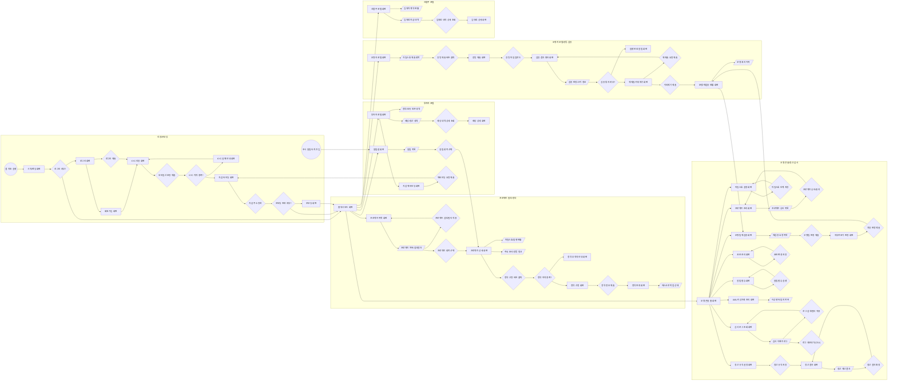

# 유저플로우

역할별 화면 이동 경로. 기능 정의는 `feature-spec.md`에 있다.

```mermaid
flowchart LR

  subgraph s1 ["인증/온보딩"]
    n1(("앱 최초 실행"))
    n2(("푸시 알림 터치 진입"))
    n3["시작/랜딩 화면"]
    n4{"로그인 여부?"}
    n5["회원가입 화면"]
    n6["로그인 화면"]
    n7{"로그인 제출"}
    n8["KYC 인증 화면"]
    n9{"모바일 신분증 제출"}
    n10{"KYC 적격 충족?"}
    n11["KYC 실패 안내 화면"]
    n12["지갑 바인딩 화면"]
    n13{"지갑 주소 등록"}
    n14{"온보딩 완료 여부?"}
    n15["온보딩 화면"]
  end

  subgraph s2 ["프로젝트 탐색/청약"]
    n16["홈 대시보드 화면"]
    n17["프로젝트 목록 화면"]
    n18[/"프로젝트 목록/검색결과"/]
    n19{"프로젝트 검색/필터 적용"}
    n20{"프로젝트 항목 선택"}
    n21["프로젝트 상세 화면"]
    n22[/"마일스톤/집행 현황"/]
    n23[/"주요 문서/증빙 링크"/]
    n24{"청약 신청 버튼 클릭"}
    n25{"청약 자격 충족?"}
    n26["청약 부적격 안내 화면"]
    n27["청약 신청 화면"]
    n28{"청약 정보 제출"}
    n29["청약 완료 화면"]
    n30[/"에스크로 락업 상태"/]
  end

  subgraph s3 ["투자자 포털"]
    n31["투자자 포털 화면"]
    n32[/"청약/보유 토큰 내역"/]
    n33[/"배당/정산 내역"/]
    n34["배당 상세 화면"]
    n35{"배당 내역 상세 조회"}
    n36["알림함 화면"]
    n37[/"알림 목록"/]
    n38{"알림 항목 선택"}
    n39["지갑 재바인딩 화면"]
    n40{"재바인딩 요청 제출"}
  end

  subgraph s4 ["운영자 포털/증빙·검증"]
    n41["운영자 포털 화면"]
    n42[/"마일스톤 제출 항목"/]
    n43{"증빙 제출 버튼 클릭"}
    n44["증빙 제출 화면"]
    n45{"증빙 파일 업로드"}
    n46["검증 결과 확인 화면"]
    n47[/"검증 판정/근거 정보"/]
    n48{"검증 통과 여부?"}
    n49["집행 완료 알림 화면"]
    n50["재제출/이의제기 화면"]
    n51{"재제출 요청 제출"}
    n52{"이의제기 제출"}
    n53["분쟁/재검증 현황 화면"]
    n54[/"분쟁 처리 이력"/]
  end

  subgraph s5 ["건물주 포털"]
    n55["건물주 포털 화면"]
    n56[/"임대차 계약 현황"/]
    n57[/"임대료 지급 내역"/]
    n58["임대료 상세 화면"]
    n59{"임대료 내역 상세 조회"}
  end

  subgraph s6 ["운영 콘솔/정산·감사"]
    n60["운영 콘솔 홈 화면"]
    n61["프로젝트 관리 화면"]
    n62[/"프로젝트 승인 목록"/]
    n63{"프로젝트 승인/중지"}
    n64["마일스톤 설정 화면"]
    n65{"마일스톤 단계 저장"}
    n66["운영팀 재검증 화면"]
    n67[/"재검증 요청 목록"/]
    n68{"운영팀 판정 제출"}
    n69["외부전문가 판정 화면"]
    n70{"최종 판정 제출"}
    n71["정산 규칙 설정 화면"]
    n72{"정산 규칙 저장"}
    n73["정산 결과 화면"]
    n74[/"정산 계산 결과"/]
    n75{"정산 결과 확정"}
    n76["감사 로그 조회 화면"]
    n77[/"감사 이벤트 로그"/]
    n78{"로그 검색/필터 적용"}
    n79{"로그 내보내기(CSV)"}
    n80["권한 관리 화면"]
    n81{"권한 변경 저장"}
    n82["알림 발송 화면"]
    n83{"알림 발송 실행"}
    n84["AML/이상거래 관리 화면"]
    n85[/"이상 행위 탐지 목록"/]
  end

  n1 --> n3
  n2 --> n36
  n3 --> n4
  n4 --> n6
  n4 --> n16
  n6 --> n5
  n5 --> n8
  n6 --> n7
  n7 --> n8
  n8 --> n9
  n9 --> n10
  n10 --> n11
  n10 --> n12
  n11 --> n8
  n12 --> n13
  n13 --> n14
  n14 --> n15
  n14 --> n16
  n15 --> n16
  n16 --> n17
  n17 --> n18
  n18 --> n19
  n19 --> n17
  n18 --> n20
  n20 --> n21
  n21 --> n22
  n21 --> n23
  n21 --> n24
  n24 --> n25
  n25 --> n26
  n25 --> n27
  n27 --> n28
  n28 --> n29
  n29 --> n30
  n16 --> n31
  n31 --> n32
  n31 --> n33
  n33 --> n35
  n35 --> n34
  n16 --> n36
  n36 --> n37
  n37 --> n38
  n38 --> n21
  n31 --> n39
  n39 --> n40
  n40 --> n12
  n16 --> n41
  n41 --> n42
  n42 --> n43
  n43 --> n44
  n44 --> n45
  n45 --> n46
  n46 --> n47
  n47 --> n48
  n48 --> n49
  n48 --> n50
  n50 --> n51
  n50 --> n52
  n51 --> n46
  n52 --> n53
  n53 --> n54
  n16 --> n55
  n55 --> n56
  n55 --> n57
  n57 --> n59
  n59 --> n58
  n16 --> n60
  n60 --> n61
  n61 --> n62
  n62 --> n63
  n63 --> n61
  n60 --> n64
  n64 --> n65
  n65 --> n64
  n60 --> n66
  n66 --> n67
  n67 --> n68
  n68 --> n69
  n69 --> n70
  n70 --> n53
  n53 --> n66
  n60 --> n71
  n71 --> n72
  n72 --> n73
  n73 --> n74
  n74 --> n75
  n75 --> n73
  n60 --> n76
  n76 --> n77
  n77 --> n78
  n78 --> n76
  n77 --> n79
  n60 --> n80
  n80 --> n81
  n81 --> n80
  n60 --> n82
  n82 --> n83
  n83 --> n82
  n60 --> n84
  n84 --> n85
```
